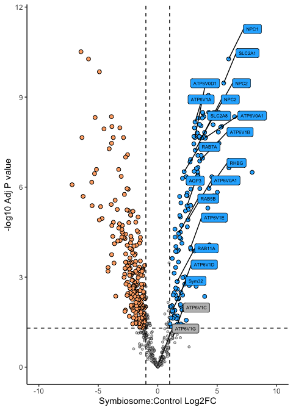
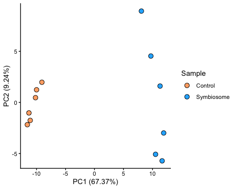
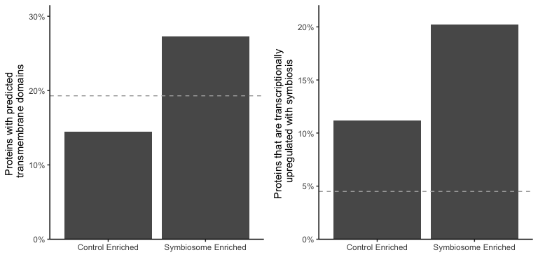

Aiptasia_Bmin_search
================
Shumpei Maruyama
2026-03-02

- [Aiptasia and Breviolum minutum combined
  search](#aiptasia-and-breviolum-minutum-combined-search)

## Aiptasia and Breviolum minutum combined search

``` r
knitr::opts_chunk$set(echo = TRUE, warning = FALSE, message = FALSE)
```

``` r
# See README for environment setup instructions
library(topGO)
library(tidyverse) 
library(stringr)
library(ggplot2) 
library(ggrepel)
library(readxl)
library(ggfortify)
library(NormalyzerDE)
library(ggpubr)
```

``` r
#Grab protein data
rawdata <- read.table("Inputs/combined_protein_Aiptasia_and_Bmin.tsv", sep= "\t",  header=TRUE, quote="")

#Extract Aiptasia proteins, removing contaminants
rawdata_Aiponly <- rawdata %>% filter(str_detect(Protein.ID, "^AIP"))

#Extract only intensity values for Normalyzer
rawdata_Aiponly_intensity <- rawdata_Aiponly %>% dplyr::select("Protein.ID","Symbiosome_1.Intensity","Symbiosome_2.Intensity","Symbiosome_3.Intensity","Symbiosome_4.Intensity","Symbiosome_5.Intensity","Symbiosome_6.Intensity","Control_1.Intensity","Control_2.Intensity","Control_3.Intensity","Control_4.Intensity","Control_5.Intensity","Control_6.Intensity")

#Write table into file
write.table(rawdata_Aiponly_intensity, file="Aiptasia_Bmin_search_output/Aiptasia_proteins.tsv", sep="\t", row.names=F, quote=F)
```

``` r
#Use Normalyzer on curated data
outDir <- "Aiptasia_Bmin_search_output"
designFp <- "Inputs/Normalyzermatrix.tsv"
dataFp <- "Aiptasia_Bmin_search_output/Aiptasia_proteins.tsv"
normalyzer(jobName="vignette_run_Aipnorm", designPath=designFp, dataPath=dataFp, outputDir=outDir)
```

``` r
#Perform statistical analysis using Normalyzer on Cyclic Loess normalized data
normMatrixPath <- paste(outDir, "vignette_run_Aipnorm/CycLoess-normalized.txt", sep="/")
normalyzerDE("vignette_run_Aipnorm",
  comparisons=c("Control-Symbiosome"),
  designPath=designFp,
  dataPath=normMatrixPath,
  outputDir=outDir,
  condCol="group")
```

    ## [1] "Setting up statistics object"
    ## [1] "Calculating statistical contrasts..."
    ## [1] "Contrast calculations done!"
    ## [1] "Writing 2035 annotated rows to Aiptasia_Bmin_search_output/vignette_run_Aipnorm/vignette_run_Aipnorm_stats.tsv"
    ## [1] "Writing statistics report"

    ## [1] "All done! Results are stored in: Aiptasia_Bmin_search_output/vignette_run_Aipnorm, processing time was 0 minutes"

``` r
#Rename spreadsheet
CycLoess_Aiponly <- read.table("Aiptasia_Bmin_search_output/vignette_run_Aipnorm/vignette_run_Aipnorm_stats.tsv", sep="\t", header=TRUE)
CycLoess_Aiponly <- CycLoess_Aiponly %>% rename("CycLoess_Con1"="Control_1.Intensity")
CycLoess_Aiponly <- CycLoess_Aiponly %>% rename("CycLoess_Con2"="Control_2.Intensity")
CycLoess_Aiponly <- CycLoess_Aiponly %>% rename("CycLoess_Con3"="Control_3.Intensity")
CycLoess_Aiponly <- CycLoess_Aiponly %>% rename("CycLoess_Con4"="Control_4.Intensity")
CycLoess_Aiponly <- CycLoess_Aiponly %>% rename("CycLoess_Con5"="Control_5.Intensity")
CycLoess_Aiponly <- CycLoess_Aiponly %>% rename("CycLoess_Con6"="Control_6.Intensity")
CycLoess_Aiponly <- CycLoess_Aiponly %>% rename("CycLoess_Sym1"="Symbiosome_1.Intensity")
CycLoess_Aiponly <- CycLoess_Aiponly %>% rename("CycLoess_Sym2"="Symbiosome_2.Intensity")
CycLoess_Aiponly <- CycLoess_Aiponly %>% rename("CycLoess_Sym3"="Symbiosome_3.Intensity")
CycLoess_Aiponly <- CycLoess_Aiponly %>% rename("CycLoess_Sym4"="Symbiosome_4.Intensity")
CycLoess_Aiponly <- CycLoess_Aiponly %>% rename("CycLoess_Sym5"="Symbiosome_5.Intensity")
CycLoess_Aiponly <- CycLoess_Aiponly %>% rename("CycLoess_Sym6"="Symbiosome_6.Intensity")

#Merge with annotations
Annotations <- read.table("Inputs/aiptasia_genome.annot.tsv",quote="", sep="\t", header=TRUE)
Annotated_proteome <- left_join(CycLoess_Aiponly, Annotations, by=c("Protein.ID"="Query"))

#Merge with Apo/Sym RNAseq from Cleves et al. 2020 PNAS data 
library(readxl)
RNAseq <- read_excel("Inputs/symbiosis_associated_genes.xlsx", skip = 2)
RNAseq <- RNAseq %>% dplyr::select(Aipgenes, log2FoldChange_Sym0_Apo0, padj_Sym0_Apo0)
Annotated_proteome_RNAseq <- left_join(Annotated_proteome, RNAseq, by=c("Protein.ID"="Aipgenes"))

#Add TM annotation from TMHMM2.0 prediction
TM_Aipgene <- read.table("Inputs/TMHMM_Aiptasia_genome_output.tsv", sep='\t')
Annotated_proteome_RNAseq_TM <- left_join(Annotated_proteome_RNAseq, TM_Aipgene[,c("V1","V5")], by=c("Protein.ID"="V1"))
Annotated_proteome_RNAseq_TM <- Annotated_proteome_RNAseq_TM %>% rename("TM_Helices"="V5")
Annotated_proteome_RNAseq_TM$TM_Helices <- str_extract(Annotated_proteome_RNAseq_TM$TM_Helices, '\\d+')
```

``` r
#Find significantly enriched proteins
counts <- Annotated_proteome_RNAseq_TM

# Create new categorical column 
counts <- counts %>%
  mutate(Enrichment = case_when(Control.Symbiosome_log2FoldChange >= 1 & Control.Symbiosome_AdjPVal <= 0.05 ~ "ConEnriched",
                               Control.Symbiosome_log2FoldChange <= -1 & Control.Symbiosome_AdjPVal <= 0.05 ~ "SymEnriched",
                               TRUE ~ "NS"))
```

``` r
#Pull out Symbiosome-enriched proteins
countssymenriched=counts %>%
  filter(Enrichment=="SymEnriched") %>% arrange(Control.Symbiosome_log2FoldChange)

#Remove symbiosome-enriched proteins found in less than 3 samples.
countssymenriched <- countssymenriched %>%
 filter((!is.na(CycLoess_Sym1)) + (!is.na(CycLoess_Sym2)) + (!is.na(CycLoess_Sym3)) + (!is.na(CycLoess_Sym4)) + (!is.na(CycLoess_Sym5)) + (!is.na(CycLoess_Sym6)) >= 3)

#Find Unique genes in Sym -This is only unique proteins that are found in at least 3 sym samples and not in any of the controls.
CountsnotinCon <- counts %>%
  filter((is.na(CycLoess_Con1)) + (is.na(CycLoess_Con2)) + (is.na(CycLoess_Con3)) + (is.na(CycLoess_Con4)) + (is.na(CycLoess_Con5)) + (is.na(CycLoess_Con6)) == 6)
CountsnotinCon_Sym <- CountsnotinCon %>%
  filter((!is.na(CycLoess_Sym1)) + (!is.na(CycLoess_Sym2)) + (!is.na(CycLoess_Sym3)) + (!is.na(CycLoess_Sym4)) + (!is.na(CycLoess_Sym5)) + (!is.na(CycLoess_Sym6)) >= 3)

#Combined dataframes countssymenriched with the unique genes
countssymenriched <- rbind(countssymenriched,CountsnotinCon_Sym)
countssymenriched$Enrichment <- "SymEnriched"
#Write csv file
write.csv(countssymenriched,file="Aiptasia_Bmin_search_output/Symbiosome_enriched_proteins.csv", row.names=F)
```

``` r
#Pull out Control-enriched proteins
countsconenriched <- counts %>%
  filter(Enrichment=="ConEnriched") %>% arrange(Control.Symbiosome_log2FoldChange)

#Remove control-enriched proteins found in less than 3 samples.
countsconenriched <- countsconenriched %>%
  filter((!is.na(CycLoess_Con1)) + (!is.na(CycLoess_Con2)) + (!is.na(CycLoess_Con3)) + (!is.na(CycLoess_Con4)) + (!is.na(CycLoess_Con5)) + (!is.na(CycLoess_Con6)) >= 3)

#Find Unique proteins in con -This is only unique proteins that are found in at least 3 con samples and not in any of the symbiosome.
CountsinCon <- counts %>%
  filter((!is.na(CycLoess_Con1)) + (!is.na(CycLoess_Con2)) + (!is.na(CycLoess_Con3)) + (!is.na(CycLoess_Con4)) + (!is.na(CycLoess_Con5)) + (!is.na(CycLoess_Con6)) >= 3)
CountsinCon_notinSym=CountsinCon %>%
  filter((is.na(CycLoess_Sym1)) + (is.na(CycLoess_Sym2)) + (is.na(CycLoess_Sym3)) + (is.na(CycLoess_Sym4)) + (is.na(CycLoess_Sym5)) + (is.na(CycLoess_Sym6)) == 6)

#Combined dataframes countsconenriched with the unique genes
countsconenriched <- rbind(countsconenriched,CountsinCon_notinSym)
countsconenriched$Enrichment <- "ConEnriched"

#Write csv
write.csv(countsconenriched,file="Aiptasia_Bmin_search_output/Control_enriched_proteins.csv", row.names=F)
```

``` r
library(ggplot2)
cols <- c("ConEnriched" = "#ffad73", "SymEnriched" = "#26b3ff", "NS" = "grey") 
sizes <- c("ConEnriched" = 2, "SymEnriched" = 2, "NS" = 1) 
alphas <- c("ConEnriched" = 1, "SymEnriched" = 1, "NS" = 0.5)
library(tidyverse)
counts_noNSig <- counts %>% filter(Enrichment == "NS")
counts_vol <- rbind(countssymenriched, countsconenriched, counts_noNSig)

Known_genes <- read.csv("Inputs/Known_symbiosome_genes.csv",header=T)

counts_vol_known<-left_join(counts_vol,Known_genes,by=c("Protein.ID"="AIPGENE"))

library(ggrepel)
#library(lubridate)
#library(grid)
#library(ggpp)

vol_plot_known <- counts_vol_known %>%
  ggplot(aes(x = -Control.Symbiosome_log2FoldChange,
             y = -log10(Control.Symbiosome_AdjPVal),
             fill = Enrichment,    
             size = Enrichment,
             alpha = Enrichment,
             label = GENE)) +
  theme_classic() +
   geom_point(shape=21, show.legend=F) +
    scale_fill_manual(values = cols, name="Expression") + # Modify point colour
    scale_size_manual(values = sizes, name="Expression") + # Modify point size
    scale_alpha_manual(values = alphas, name="Expression") +
  labs(x="Symbiosome:Control Log2FC", y="-log10 Adj P value")+
  geom_hline(yintercept = -log10(0.05), linetype = "dashed") +
  geom_vline(xintercept = c(-1, 1), linetype = "dashed") +
  xlim(-10,10) + geom_label_repel(show.legend=F,size=2,alpha=1,max.overlaps = Inf, aes(),
    position = position_nudge_repel(x=2,y = 1),box.padding=0.3)
vol_plot_known
```

<!-- -->

``` r
#PCA plots
PCAdata <- counts %>% dplyr::select("Protein.ID","CycLoess_Con1", "CycLoess_Con2", "CycLoess_Con3","CycLoess_Con4","CycLoess_Con5","CycLoess_Con6", "CycLoess_Sym1","CycLoess_Sym2","CycLoess_Sym3","CycLoess_Sym4","CycLoess_Sym5","CycLoess_Sym6")
PCAdata <- PCAdata %>% tidyr::drop_na()
PCAdata <- setNames(data.frame(t(PCAdata[,-1])), PCAdata[,1])
PCAdata <- PCAdata %>% 
  rownames_to_column(var = "ID")
PCAdata$Replicate <- c("1","2","3","1","2","3")
PCAdata$Treatment <- c("Control","Control","Control","Control","Control","Control","Symbiosome","Symbiosome", "Symbiosome","Symbiosome","Symbiosome", "Symbiosome")
PCAdata <- PCAdata %>% relocate("Replicate", .after="ID")
PCAdata <- PCAdata %>% relocate("Treatment", .before="Replicate")
PCAdata <- PCAdata%>% dplyr::select(-c("ID","Replicate"))
pca_res <- prcomp(PCAdata[,-1], scale. = TRUE)
PCi <-data.frame(pca_res$x,Treatment=PCAdata$Treatment)

pca_var <- pca_res$sdev^2
pca_var_pct <- round(pca_var / sum(pca_var) * 100, 2)

PC1_label <- paste0("PC1 (", pca_var_pct[1], "%)")
PC2_label <- paste0("PC2 (", pca_var_pct[2], "%)")

ggplot(PCi,aes(x=PC1,y=PC2,fill=Treatment))+
   geom_point(size=3, shape=21)+ #Size and alpha just for fun
   scale_fill_manual(values = c("#ffad73","#26b3ff"))+ #your colors here
  xlab(PC1_label) + ylab(PC2_label)+
  labs(fill = "Sample") +
  theme_classic() 
```

<!-- -->

``` r
#Extract just Protein IDs for GO-term enrichment analysis
conenriched_AIPGENES <- countsconenriched[,"Protein.ID", drop=FALSE]
write.table(conenriched_AIPGENES, file="Aiptasia_Bmin_search_output/GO_Input/ConEnriched.txt", row.names=F, quote=F)

symenriched_AIPGENES <- countssymenriched[,"Protein.ID", drop=FALSE]
write.table(symenriched_AIPGENES, file="Aiptasia_Bmin_search_output/GO_Input/SymEnriched.txt", row.names=F, quote=F)
```

    ## [1] "Current file: ConEnriched.txt"

    ## [1] "Current file: SymEnriched.txt"

    ## [1] "Current file: ConEnriched.txt"

    ## [1] "Current file: SymEnriched.txt"

    ## [1] "Current file: ConEnriched.txt"

    ## [1] "Current file: SymEnriched.txt"

``` r
#Find top 10 most significantly enriched cell-compartment GO-terms with at least 5 significant terms.
cc_Symenriched <- read.table("Aiptasia_Bmin_search_output/GO_Output/cc_SymEnriched.txt",sep="\t",header=T)
cc_Symenriched <- cc_Symenriched%>% filter((P_value<=0.05)) %>% filter(Significant>=5)
cc_Symenriched <-head(n=10,cc_Symenriched)

cc_Conenriched <- read.table("Aiptasia_Bmin_search_output/GO_Output/cc_ConEnriched.txt",sep="\t",header=T)
cc_Conenriched$P_value <- as.numeric(ifelse(cc_Conenriched$P_value=="< 1e-30", 1*10^-30, cc_Conenriched$P_value))
cc_Conenriched <- cc_Conenriched%>% filter(P_value<=0.05) %>% filter(Significant>=5)
cc_Conenriched <-head(n=10,cc_Conenriched)
```

``` r
#Make figures for cell compartment GO-terms

CCplot_symenriched<-ggplot(cc_Symenriched, aes(x= reorder(Term, -P_value), y=-log10(P_value))) + 
  geom_bar(stat = "identity", width=0.5) +   scale_y_continuous(expand = expansion(mult = c(0, 0.05)))+
  coord_flip() +
  theme_classic()+theme(axis.text.x = element_text(angle = 90, vjust = 0.5, hjust=1)) + 
  labs(y="-log10(P-value)",x="", title="Symbiosome enriched")

CCplot_conenriched<-ggplot(cc_Conenriched, aes(x= reorder(Term, -P_value), y=-log10(P_value))) + 
  geom_bar(stat = "identity", width=0.5) +   scale_y_continuous(expand = expansion(mult = c(0, 0.05)))+
  coord_flip() +
  theme_classic()+theme(axis.text.x = element_text(angle = 90, vjust = 0.5, hjust=1)) + 
  labs(y="-log10(P-value)",x="", title="Control enriched")

allCCplots<- ggarrange(CCplot_conenriched, CCplot_symenriched,nrow=1, common.legend = TRUE, legend = "right")
allCCplots
```

<!-- -->

``` r
#Make figures for transmembrane protein analysis and RNAseq comparison
counts_vol$SAG <- ifelse(counts_vol$log2FoldChange_Sym0_Apo0>=1, "TRUE", "FALSE")
counts_vol$TM <- ifelse(counts_vol$TM_Helices>=1, "TRUE", "FALSE")

SAGsymcount <- length(which(counts_vol$Enrichment == "SymEnriched" & counts_vol$SAG=="TRUE"))
totalsymcount <- length(which(counts_vol$Enrichment=="SymEnriched"))
Percent_symSAG <- SAGsymcount/(totalsymcount)

print(paste("Proportion of SAG proteins is:",Percent_symSAG,"%"))
```

    ## [1] "Proportion of SAG proteins is: 0.202185792349727 %"

``` r
SAGconcount <- length(which(counts_vol$Enrichment == "ConEnriched" & counts_vol$SAG=="TRUE"))
totalconcount <- length(which(counts_vol$Enrichment=="ConEnriched"))
Percent_conSAG <- SAGconcount/totalconcount
print(paste("Proportion of SAG proteins is:",Percent_conSAG,"%"))
```

    ## [1] "Proportion of SAG proteins is: 0.11166253101737 %"

``` r
TMsymcount <- length(which(counts_vol$Enrichment == "SymEnriched" & counts_vol$TM=="TRUE"))
Percent_symTM <- TMsymcount/totalsymcount
print(paste("Proportion of TM proteins is:",Percent_symTM,"%"))
```

    ## [1] "Proportion of TM proteins is: 0.273224043715847 %"

``` r
TMconcount <- length(which(counts_vol$Enrichment == "ConEnriched" & counts_vol$TM=="TRUE"))
totalconcount
```

    ## [1] 1209

``` r
Percent_conTM <- TMconcount/totalconcount
print(paste("Proportion of TM proteins is:",Percent_conTM,"%"))
```

    ## [1] "Proportion of TM proteins is: 0.144747725392887 %"

``` r
SAG_TM_data <- data.frame(
  Enrichment = c("Control Enriched", "Symbiosome Enriched"),
  SAG = c(Percent_conSAG, Percent_symSAG),  # fill in your counts
  TM = c(Percent_conTM, Percent_symTM)    # fill in your counts
)


TMPercentplot <- ggplot(SAG_TM_data, aes(x=Enrichment, y=TM)) +
geom_bar(stat="identity", position=position_dodge()) +theme_classic() +
  scale_y_continuous(labels=scales::percent,limits=c(0,.3), expand = expansion(mult = c(0, 0.05))) + labs(x="") +
   geom_hline(yintercept = .193, color = "darkgray", linetype = "dashed") + ylab("Proteins with predicted \n transmembrane domains")

SAGPercentplot <- ggplot(SAG_TM_data, aes(x=Enrichment, y=SAG)) +
geom_bar(stat="identity", position=position_dodge()) +theme_classic() +
  scale_y_continuous(labels=scales::percent,limits=c(0,.21), expand = expansion(mult = c(0, 0.05))) + labs(x="")+
   geom_hline(yintercept = .045, color = "darkgray", linetype = "dashed") + ylab("Proteins that are transcriptionally \n upregulated with symbiosis")

ggarrange(TMPercentplot, SAGPercentplot)
```

<!-- -->

``` r
sessionInfo()
```

    ## R version 4.3.3 (2024-02-29)
    ## Platform: aarch64-apple-darwin20 (64-bit)
    ## Running under: macOS 15.7.3
    ## 
    ## Matrix products: default
    ## BLAS:   /Library/Frameworks/R.framework/Versions/4.3-arm64/Resources/lib/libRblas.0.dylib 
    ## LAPACK: /Library/Frameworks/R.framework/Versions/4.3-arm64/Resources/lib/libRlapack.dylib;  LAPACK version 3.11.0
    ## 
    ## locale:
    ## [1] en_US.UTF-8/en_US.UTF-8/en_US.UTF-8/C/en_US.UTF-8/en_US.UTF-8
    ## 
    ## time zone: America/Los_Angeles
    ## tzcode source: internal
    ## 
    ## attached base packages:
    ## [1] stats4    stats     graphics  grDevices datasets  utils     methods  
    ## [8] base     
    ## 
    ## other attached packages:
    ##  [1] ggpubr_0.6.0         NormalyzerDE_1.20.0  ggfortify_0.4.17    
    ##  [4] readxl_1.4.5         ggrepel_0.9.6        lubridate_1.9.5     
    ##  [7] forcats_1.0.1        stringr_1.6.0        dplyr_1.2.0         
    ## [10] purrr_1.2.1          readr_2.2.0          tidyr_1.3.2         
    ## [13] tibble_3.3.1         ggplot2_4.0.2        tidyverse_2.0.0     
    ## [16] topGO_2.54.0         SparseM_1.84-2       GO.db_3.18.0        
    ## [19] AnnotationDbi_1.64.1 IRanges_2.36.0       S4Vectors_0.40.2    
    ## [22] Biobase_2.62.0       graph_1.80.0         BiocGenerics_0.48.1 
    ## 
    ## loaded via a namespace (and not attached):
    ##  [1] DBI_1.3.0                   bitops_1.0-9               
    ##  [3] gridExtra_2.3               rlang_1.1.7                
    ##  [5] magrittr_2.0.4              matrixStats_1.5.0          
    ##  [7] compiler_4.3.3              RSQLite_2.4.6              
    ##  [9] mgcv_1.9-1                  png_0.1-8                  
    ## [11] vctrs_0.7.1                 pkgconfig_2.0.3            
    ## [13] crayon_1.5.3                fastmap_1.2.0              
    ## [15] backports_1.5.0             XVector_0.42.0             
    ## [17] labeling_0.4.3              rmarkdown_2.30             
    ## [19] tzdb_0.5.0                  preprocessCore_1.64.0      
    ## [21] bit_4.6.0                   xfun_0.56                  
    ## [23] zlibbioc_1.48.2             cachem_1.1.0               
    ## [25] GenomeInfoDb_1.38.8         blob_1.3.0                 
    ## [27] DelayedArray_0.28.0         parallel_4.3.3             
    ## [29] broom_1.0.12                R6_2.6.1                   
    ## [31] stringi_1.8.7               RColorBrewer_1.1-3         
    ## [33] limma_3.58.1                car_3.1-5                  
    ## [35] GenomicRanges_1.54.1        cellranger_1.1.0           
    ## [37] Rcpp_1.1.1                  SummarizedExperiment_1.32.0
    ## [39] knitr_1.51                  splines_4.3.3              
    ## [41] Matrix_1.6-5                timechange_0.4.0           
    ## [43] tidyselect_1.2.1            rstudioapi_0.18.0          
    ## [45] abind_1.4-8                 yaml_2.3.12                
    ## [47] affy_1.80.0                 lattice_0.22-5             
    ## [49] withr_3.0.2                 KEGGREST_1.42.0            
    ## [51] S7_0.2.1                    evaluate_1.0.5             
    ## [53] Biostrings_2.70.3           affyio_1.72.0              
    ## [55] pillar_1.11.1               BiocManager_1.30.27        
    ## [57] MatrixGenerics_1.14.0       carData_3.0-6              
    ## [59] renv_1.1.7                  generics_0.1.4             
    ## [61] RCurl_1.98-1.17             hms_1.1.4                  
    ## [63] scales_1.4.0                glue_1.8.0                 
    ## [65] tools_4.3.3                 hexbin_1.28.5              
    ## [67] vsn_3.70.0                  ggsignif_0.6.4             
    ## [69] cowplot_1.2.0               grid_4.3.3                 
    ## [71] ape_5.8-1                   colorspace_2.1-2           
    ## [73] nlme_3.1-164                GenomeInfoDbData_1.2.11    
    ## [75] Formula_1.2-5               cli_3.6.5                  
    ## [77] S4Arrays_1.2.1              gtable_0.3.6               
    ## [79] rstatix_0.7.2               digest_0.6.39              
    ## [81] SparseArray_1.2.4           farver_2.1.2               
    ## [83] memoise_2.0.1               htmltools_0.5.9            
    ## [85] lifecycle_1.0.5             httr_1.4.8                 
    ## [87] statmod_1.5.1               bit64_4.6.0-1              
    ## [89] MASS_7.3-60.0.1
