Analyses for Symbiosome proteomics
================
Shumpei Maruyama
2026-03-02

- [Setup](#setup)
- [Aiptasia genome only search](#aiptasia-genome-only-search)
- [Aiptasia and Breviolum minutum combined
  search](#aiptasia-and-breviolum-minutum-combined-search)
- [Aiptasia only search with Breviolum minutum peptides
  removed](#aiptasia-only-search-with-breviolum-minutum-peptides-removed)
- [Aiptasia and Breviolum minutum combined search with Breviolum minutum
  peptides
  removed](#aiptasia-and-breviolum-minutum-combined-search-with-breviolum-minutum-peptides-removed)
- [Aiptasia and scrambled Breviolum minutum combined
  search](#aiptasia-and-scrambled-breviolum-minutum-combined-search)
- [Symbiosome-enriched protein
  comparisons](#symbiosome-enriched-protein-comparisons)
- [Figure 1](#figure-1)
- [Figure 3](#figure-3)
- [Figure 4](#figure-4)
- [Figure 5](#figure-5)
- [Figure S9](#figure-s9)
- [Figure S10](#figure-s10)
- [Figure S12](#figure-s12)
- [Figure S14](#figure-s14)

## Setup

``` r
knitr::opts_chunk$set(echo = TRUE, warning = FALSE, message = FALSE)
```

``` r
# See README for environment setup instructions
library(topGO)
library(tidyverse) 
library(stringr)
library(ggplot2) 
library(ggrepel)
library(readxl)
library(ggfortify)
library(NormalyzerDE)
library(ggpubr)
library(rcompanion)
library(ggbeeswarm)
library(scales)
library(conover.test)
library(FSA)
```

## Aiptasia genome only search

``` r
# Grab protein data
rawdata <- read.table("Inputs/combined_protein_Aiptasia_only.tsv", sep= "\t",  header=TRUE, quote="")

# Extract Aiptasia proteins, removing contaminants
rawdata_Aiponly <- rawdata %>% filter(str_detect(Protein.ID, "^AIP"))

# Extract only intensity values for Normalyzer
rawdata_Aiponly_intensity <- rawdata_Aiponly %>% dplyr::select("Protein.ID","Symbiosome_1.Intensity","Symbiosome_2.Intensity","Symbiosome_3.Intensity","Symbiosome_4.Intensity","Symbiosome_5.Intensity","Symbiosome_6.Intensity","Control_1.Intensity","Control_2.Intensity","Control_3.Intensity","Control_4.Intensity","Control_5.Intensity","Control_6.Intensity")

# Write table into file
write.table(rawdata_Aiponly_intensity, file="Aiptasia_only_search_output/Aiptasia_only_proteins.tsv", sep="\t", row.names=F, quote=F)
```

``` r
# Use Normalyzer on curated data
outDir <- "Aiptasia_only_search_output"
designFp <- "Inputs/Normalyzermatrix.tsv"
dataFp <- "Aiptasia_only_search_output/Aiptasia_only_proteins.tsv"
normalyzer(jobName="vignette_run_Aipnorm", designPath=designFp, dataPath=dataFp, outputDir=outDir)
```

``` r
# Perform statistical analysis using Normalyzer on Cyclic Loess normalized data
normMatrixPath <- paste(outDir, "vignette_run_Aipnorm/CycLoess-normalized.txt", sep="/")
normalyzerDE("vignette_run_Aipnorm",
  comparisons=c("Control-Symbiosome"),
  designPath=designFp,
  dataPath=normMatrixPath,
  outputDir=outDir,
  condCol="group")
```

    ## [1] "Setting up statistics object"
    ## [1] "Calculating statistical contrasts..."
    ## [1] "Contrast calculations done!"
    ## [1] "Writing 2154 annotated rows to Aiptasia_only_search_output/vignette_run_Aipnorm/vignette_run_Aipnorm_stats.tsv"
    ## [1] "Writing statistics report"

    ## [1] "All done! Results are stored in: Aiptasia_only_search_output/vignette_run_Aipnorm, processing time was 0 minutes"

``` r
# Rename spreadsheet
CycLoess_Aiponly <- read.table("Aiptasia_only_search_output/vignette_run_Aipnorm/vignette_run_Aipnorm_stats.tsv", sep="\t", header=TRUE)
CycLoess_Aiponly <- CycLoess_Aiponly %>% rename("CycLoess_Con1"="Control_1.Intensity")
CycLoess_Aiponly <- CycLoess_Aiponly %>% rename("CycLoess_Con2"="Control_2.Intensity")
CycLoess_Aiponly <- CycLoess_Aiponly %>% rename("CycLoess_Con3"="Control_3.Intensity")
CycLoess_Aiponly <- CycLoess_Aiponly %>% rename("CycLoess_Con4"="Control_4.Intensity")
CycLoess_Aiponly <- CycLoess_Aiponly %>% rename("CycLoess_Con5"="Control_5.Intensity")
CycLoess_Aiponly <- CycLoess_Aiponly %>% rename("CycLoess_Con6"="Control_6.Intensity")
CycLoess_Aiponly <- CycLoess_Aiponly %>% rename("CycLoess_Sym1"="Symbiosome_1.Intensity")
CycLoess_Aiponly <- CycLoess_Aiponly %>% rename("CycLoess_Sym2"="Symbiosome_2.Intensity")
CycLoess_Aiponly <- CycLoess_Aiponly %>% rename("CycLoess_Sym3"="Symbiosome_3.Intensity")
CycLoess_Aiponly <- CycLoess_Aiponly %>% rename("CycLoess_Sym4"="Symbiosome_4.Intensity")
CycLoess_Aiponly <- CycLoess_Aiponly %>% rename("CycLoess_Sym5"="Symbiosome_5.Intensity")
CycLoess_Aiponly <- CycLoess_Aiponly %>% rename("CycLoess_Sym6"="Symbiosome_6.Intensity")

# Merge with annotations
Annotations <- read.table("Inputs/aiptasia_genome.annot.tsv",quote="", sep="\t", header=TRUE)
Annotated_proteome <- left_join(CycLoess_Aiponly, Annotations, by=c("Protein.ID"="Query"))

# Merge with Apo/Sym RNAseq from Cleves et al. 2020 PNAS data 
RNAseq <- read_excel("Inputs/symbiosis_associated_genes.xlsx", skip = 2)
RNAseq <- RNAseq %>% dplyr::select(Aipgenes, log2FoldChange_Sym0_Apo0, padj_Sym0_Apo0)
Annotated_proteome_RNAseq <- left_join(Annotated_proteome, RNAseq, by=c("Protein.ID"="Aipgenes"))

# Add TM annotation from TMHMM2.0 prediction
TM_Aipgene <- read.table("Inputs/TMHMM_Aiptasia_genome_output.tsv", sep='\t')
Annotated_proteome_RNAseq_TM <- left_join(Annotated_proteome_RNAseq, TM_Aipgene[,c("V1","V5")], by=c("Protein.ID"="V1"))
Annotated_proteome_RNAseq_TM <- Annotated_proteome_RNAseq_TM %>% rename("TM_Helices"="V5")
Annotated_proteome_RNAseq_TM$TM_Helices <- str_extract(Annotated_proteome_RNAseq_TM$TM_Helices, '\\d+')
```

``` r
# Find significantly enriched proteins
counts <- Annotated_proteome_RNAseq_TM

# Create new categorical column 
counts <- counts %>%
  mutate(Enrichment = case_when(Control.Symbiosome_log2FoldChange >= 1 & Control.Symbiosome_AdjPVal <= 0.05 ~ "ConEnriched",
                               Control.Symbiosome_log2FoldChange <= -1 & Control.Symbiosome_AdjPVal <= 0.05 ~ "SymEnriched",
                               TRUE ~ "NS"))

# Pull out Symbiosome-enriched proteins
countssymenriched=counts %>%
  filter(Enrichment=="SymEnriched") %>% arrange(Control.Symbiosome_log2FoldChange)

# Remove symbiosome-enriched proteins found in less than 3 samples.
countssymenriched <- countssymenriched %>%
 filter((!is.na(CycLoess_Sym1)) + (!is.na(CycLoess_Sym2)) + (!is.na(CycLoess_Sym3)) + (!is.na(CycLoess_Sym4)) + (!is.na(CycLoess_Sym5)) + (!is.na(CycLoess_Sym6)) >= 3)

# Find Unique genes in Sym -This is only unique proteins that are found in at least 3 sym samples and not in any of the controls.
CountsnotinCon <- counts %>%
  filter((is.na(CycLoess_Con1)) + (is.na(CycLoess_Con2)) + (is.na(CycLoess_Con3)) + (is.na(CycLoess_Con4)) + (is.na(CycLoess_Con5)) + (is.na(CycLoess_Con6)) == 6)
CountsnotinCon_Sym <- CountsnotinCon %>%
  filter((!is.na(CycLoess_Sym1)) + (!is.na(CycLoess_Sym2)) + (!is.na(CycLoess_Sym3)) + (!is.na(CycLoess_Sym4)) + (!is.na(CycLoess_Sym5)) + (!is.na(CycLoess_Sym6)) >= 3)

# Combined dataframes countssymenriched with the unique genes
countssymenriched <- rbind(countssymenriched,CountsnotinCon_Sym)
countssymenriched$Enrichment <- "SymEnriched"
# Write csv file
write.csv(countssymenriched,file="Aiptasia_only_search_output/Symbiosome_enriched_proteins.csv", row.names=F)

# Pull out Control-enriched proteins
countsconenriched <- counts %>%
  filter(Enrichment=="ConEnriched") %>% arrange(Control.Symbiosome_log2FoldChange)

# Remove control-enriched proteins found in less than 3 samples.
countsconenriched <- countsconenriched %>%
  filter((!is.na(CycLoess_Con1)) + (!is.na(CycLoess_Con2)) + (!is.na(CycLoess_Con3)) + (!is.na(CycLoess_Con4)) + (!is.na(CycLoess_Con5)) + (!is.na(CycLoess_Con6)) >= 3)

# Find Unique proteins in con -This is only unique proteins that are found in at least 3 con samples and not in any of the symbiosome.
CountsinCon <- counts %>%
  filter((!is.na(CycLoess_Con1)) + (!is.na(CycLoess_Con2)) + (!is.na(CycLoess_Con3)) + (!is.na(CycLoess_Con4)) + (!is.na(CycLoess_Con5)) + (!is.na(CycLoess_Con6)) >= 3)
CountsinCon_notinSym=CountsinCon %>%
  filter((is.na(CycLoess_Sym1)) + (is.na(CycLoess_Sym2)) + (is.na(CycLoess_Sym3)) + (is.na(CycLoess_Sym4)) + (is.na(CycLoess_Sym5)) + (is.na(CycLoess_Sym6)) == 6)

# Combined dataframes countsconenriched with the unique genes
countsconenriched <- rbind(countsconenriched,CountsinCon_notinSym)
countsconenriched$Enrichment <- "ConEnriched"

# Write csv
write.csv(countsconenriched,file="Aiptasia_only_search_output/Control_enriched_proteins.csv", row.names=F)
```

``` r
# Plot volcano plot
cols <- c("ConEnriched" = "#ffad73", "SymEnriched" = "#26b3ff", "NS" = "grey") 
sizes <- c("ConEnriched" = 2, "SymEnriched" = 2, "NS" = 1) 
alphas <- c("ConEnriched" = 1, "SymEnriched" = 1, "NS" = 0.5)
counts_noNSig <- counts %>% filter(Enrichment == "NS")
counts_vol <- rbind(countssymenriched, countsconenriched, counts_noNSig)

Known_genes <- read.csv("Inputs/Known_symbiosome_genes.csv",header=T)

counts_vol_known<-left_join(counts_vol,Known_genes,by=c("Protein.ID"="AIPGENE"))


vol_plot_known <- counts_vol_known %>%
  ggplot(aes(x = -Control.Symbiosome_log2FoldChange,
             y = -log10(Control.Symbiosome_AdjPVal),
             fill = Enrichment,    
             size = Enrichment,
             alpha = Enrichment,
             label = GENE)) +
  theme_classic() +
   geom_point(shape=21, show.legend=F) +
    scale_fill_manual(values = cols, name="Expression") + #  Modify point colour
    scale_size_manual(values = sizes, name="Expression") + #  Modify point size
    scale_alpha_manual(values = alphas, name="Expression") +
  labs(x="Symbiosome:Control Log2FC", y="-log10 Adj P value")+
  geom_hline(yintercept = -log10(0.05), linetype = "dashed") +
  geom_vline(xintercept = c(-1, 1), linetype = "dashed") +
  xlim(-10,10) + geom_label_repel(show.legend=F,size=2,alpha=1,max.overlaps = Inf, aes(),
    position = position_nudge_repel(x=2,y = 1),box.padding=0.3)
vol_plot_known
```

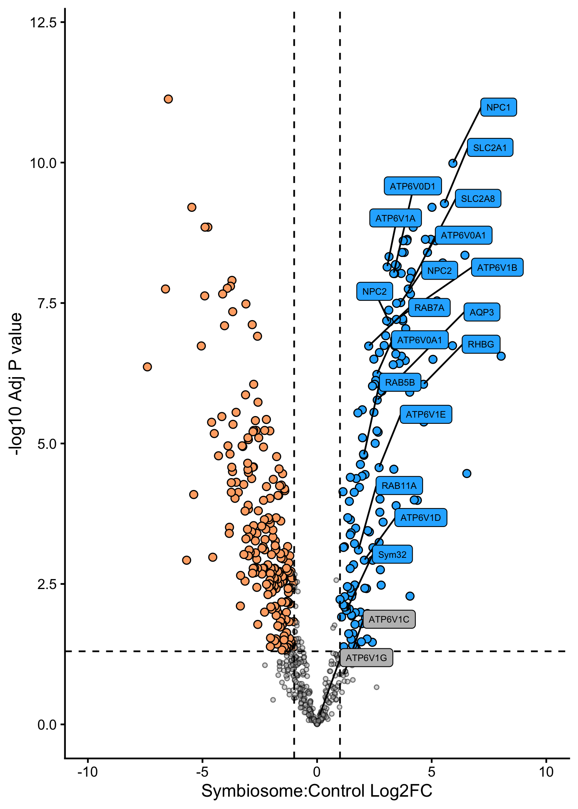<!-- -->

``` r
# PCA plots
PCAdata <- counts %>% dplyr::select("Protein.ID","CycLoess_Con1", "CycLoess_Con2", "CycLoess_Con3","CycLoess_Con4","CycLoess_Con5","CycLoess_Con6", "CycLoess_Sym1","CycLoess_Sym2","CycLoess_Sym3","CycLoess_Sym4","CycLoess_Sym5","CycLoess_Sym6")
PCAdata <- PCAdata %>% tidyr::drop_na()
PCAdata <- setNames(data.frame(t(PCAdata[,-1])), PCAdata[,1])
PCAdata <- PCAdata %>% 
  rownames_to_column(var = "ID")
PCAdata$Replicate <- c("1","2","3","1","2","3")
PCAdata$Treatment <- c("Control","Control","Control","Control","Control","Control","Symbiosome","Symbiosome", "Symbiosome","Symbiosome","Symbiosome", "Symbiosome")
PCAdata <- PCAdata %>% relocate("Replicate", .after="ID")
PCAdata <- PCAdata %>% relocate("Treatment", .before="Replicate")
PCAdata <- PCAdata%>% dplyr::select(-c("ID","Replicate"))
pca_res <- prcomp(PCAdata[,-1], scale. = TRUE)
PCi <-data.frame(pca_res$x,Treatment=PCAdata$Treatment)

pca_var <- pca_res$sdev^2
pca_var_pct <- round(pca_var / sum(pca_var) * 100, 2)

PC1_label <- paste0("PC1 (", pca_var_pct[1], "%)")
PC2_label <- paste0("PC2 (", pca_var_pct[2], "%)")

ggplot(PCi,aes(x=PC1,y=PC2,fill=Treatment))+
   geom_point(size=3, shape=21)+ # Size and alpha just for fun
   scale_fill_manual(values = c("#ffad73","#26b3ff"))+ # your colors here
  xlab(PC1_label) + ylab(PC2_label)+
  labs(fill = "Sample") +
  theme_classic() 
```

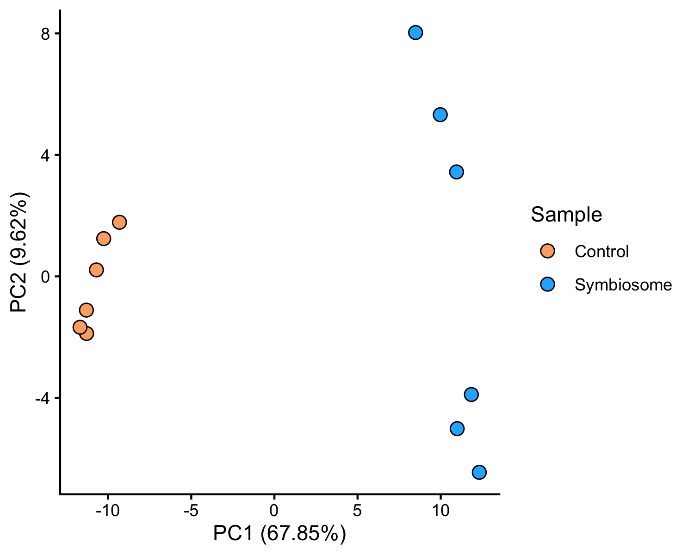<!-- -->

``` r
# Extract just Protein IDs for GO-term enrichment analysis
conenriched_AIPGENES <- countsconenriched[,"Protein.ID", drop=FALSE]
write.table(conenriched_AIPGENES, file="Aiptasia_only_search_output/GO_Input/ConEnriched.txt", row.names=F, quote=F)

symenriched_AIPGENES <- countssymenriched[,"Protein.ID", drop=FALSE]
write.table(symenriched_AIPGENES, file="Aiptasia_only_search_output/GO_Input/SymEnriched.txt", row.names=F, quote=F)
```

    ## [1] "Current file: ConEnriched.txt"

    ## [1] "Current file: SymEnriched.txt"

    ## [1] "Current file: ConEnriched.txt"

    ## [1] "Current file: SymEnriched.txt"

    ## [1] "Current file: ConEnriched.txt"

    ## [1] "Current file: SymEnriched.txt"

``` r
# Find top 10 most significantly enriched cell-compartment GO-terms with at least 5 significant terms.
cc_Symenriched <- read.table("Aiptasia_only_search_output/GO_Output/cc_SymEnriched.txt",sep="\t",header=T)
cc_Symenriched <- cc_Symenriched%>% filter((P_value<=0.05)) %>% filter(Significant>=5)
cc_Symenriched <-head(n=10,cc_Symenriched)

cc_Conenriched <- read.table("Aiptasia_only_search_output/GO_Output/cc_ConEnriched.txt",sep="\t",header=T)
cc_Conenriched$P_value <- as.numeric(ifelse(cc_Conenriched$P_value=="< 1e-30", 1*10^-30, cc_Conenriched$P_value))
cc_Conenriched <- cc_Conenriched%>% filter(P_value<=0.05) %>% filter(Significant>=5)
cc_Conenriched <-head(n=10,cc_Conenriched)

# Make figures for cell compartment GO-terms

CCplot_symenriched<-ggplot(cc_Symenriched, aes(x= reorder(Term, -P_value), y=-log10(P_value))) + 
  geom_bar(stat = "identity", width=0.5) +   scale_y_continuous(expand = expansion(mult = c(0, 0.05)))+
  coord_flip() +
  theme_classic()+theme(axis.text.x = element_text(angle = 90, vjust = 0.5, hjust=1)) + 
  labs(y="-log10(P-value)",x="", title="Symbiosome enriched")

CCplot_conenriched<-ggplot(cc_Conenriched, aes(x= reorder(Term, -P_value), y=-log10(P_value))) + 
  geom_bar(stat = "identity", width=0.5) +   scale_y_continuous(expand = expansion(mult = c(0, 0.05)))+
  coord_flip() +
  theme_classic()+theme(axis.text.x = element_text(angle = 90, vjust = 0.5, hjust=1)) + 
  labs(y="-log10(P-value)",x="", title="Control enriched")

allCCplots<- ggarrange(CCplot_conenriched, CCplot_symenriched,nrow=1, common.legend = TRUE, legend = "right")
allCCplots
```

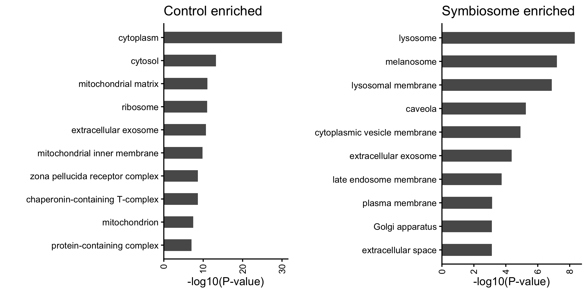<!-- -->

``` r
# Make figures for transmembrane protein analysis and RNAseq comparison for Figure 2C

counts_vol$SAG <- ifelse(counts_vol$log2FoldChange_Sym0_Apo0>=1, "TRUE", "FALSE")
counts_vol$TM <- ifelse(counts_vol$TM_Helices>=1, "TRUE", "FALSE")

SAGsymcount <- length(which(counts_vol$Enrichment == "SymEnriched" & counts_vol$SAG=="TRUE"))
totalsymcount <- length(which(counts_vol$Enrichment=="SymEnriched"))
Percent_symSAG <- SAGsymcount/(totalsymcount)


SAGconcount <- length(which(counts_vol$Enrichment == "ConEnriched" & counts_vol$SAG=="TRUE"))
totalconcount <- length(which(counts_vol$Enrichment=="ConEnriched"))
Percent_conSAG <- SAGconcount/totalconcount

TMsymcount <- length(which(counts_vol$Enrichment == "SymEnriched" & counts_vol$TM=="TRUE"))
Percent_symTM <- TMsymcount/totalsymcount

TMconcount <- length(which(counts_vol$Enrichment == "ConEnriched" & counts_vol$TM=="TRUE"))
Percent_conTM <- TMconcount/totalconcount


SAG_TM_data <- data.frame(
  Enrichment = c("Control Enriched", "Symbiosome Enriched"),
  SAG = c(Percent_conSAG, Percent_symSAG),  #  fill in your counts
  TM = c(Percent_conTM, Percent_symTM)    #  fill in your counts
)


TMPercentplot <- ggplot(SAG_TM_data, aes(x=Enrichment, y=TM)) +
geom_bar(stat="identity", position=position_dodge()) +theme_classic() +
  scale_y_continuous(labels=scales::percent,limits=c(0,.3), expand = expansion(mult = c(0, 0.05))) + labs(x="") +
   geom_hline(yintercept = .193, color = "darkgray", linetype = "dashed") + ylab("Proteins with predicted \n transmembrane domains")

SAGPercentplot <- ggplot(SAG_TM_data, aes(x=Enrichment, y=SAG)) +
geom_bar(stat="identity", position=position_dodge()) +theme_classic() +
  scale_y_continuous(labels=scales::percent,limits=c(0,.2), expand = expansion(mult = c(0, 0.05))) + labs(x="")+
   geom_hline(yintercept = .045, color = "darkgray", linetype = "dashed") + ylab("Proteins that are transcriptionally \n upregulated with symbiosis")

ggarrange(TMPercentplot, SAGPercentplot)
```

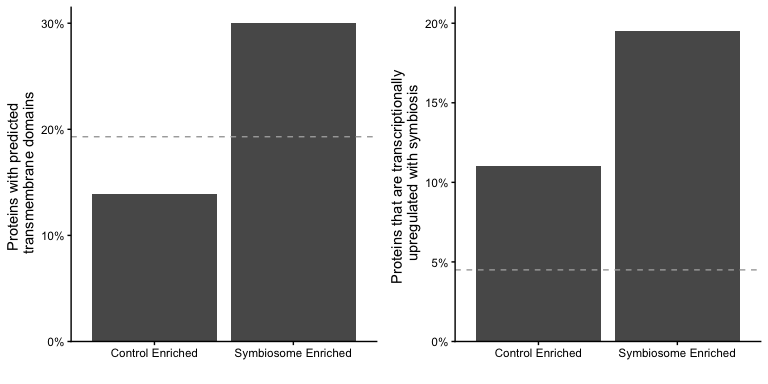<!-- -->

## Aiptasia and Breviolum minutum combined search

``` r
# Grab protein data
rawdata <- read.table("Inputs/combined_protein_Aiptasia_and_Bmin.tsv", sep= "\t",  header=TRUE, quote="")

# Extract Aiptasia proteins, removing contaminants
rawdata_Aiponly <- rawdata %>% filter(str_detect(Protein.ID, "^AIP"))

# Extract only intensity values for Normalyzer
rawdata_Aiponly_intensity <- rawdata_Aiponly %>% dplyr::select("Protein.ID","Symbiosome_1.Intensity","Symbiosome_2.Intensity","Symbiosome_3.Intensity","Symbiosome_4.Intensity","Symbiosome_5.Intensity","Symbiosome_6.Intensity","Control_1.Intensity","Control_2.Intensity","Control_3.Intensity","Control_4.Intensity","Control_5.Intensity","Control_6.Intensity")

# Write table into file
write.table(rawdata_Aiponly_intensity, file="Aiptasia_Bmin_search_output/Aiptasia_proteins.tsv", sep="\t", row.names=F, quote=F)
```

``` r
# Use Normalyzer on curated data
outDir <- "Aiptasia_Bmin_search_output"
designFp <- "Inputs/Normalyzermatrix.tsv"
dataFp <- "Aiptasia_Bmin_search_output/Aiptasia_proteins.tsv"
normalyzer(jobName="vignette_run_Aipnorm", designPath=designFp, dataPath=dataFp, outputDir=outDir)
```

``` r
# Perform statistical analysis using Normalyzer on Cyclic Loess normalized data
normMatrixPath <- paste(outDir, "vignette_run_Aipnorm/CycLoess-normalized.txt", sep="/")
normalyzerDE("vignette_run_Aipnorm",
  comparisons=c("Control-Symbiosome"),
  designPath=designFp,
  dataPath=normMatrixPath,
  outputDir=outDir,
  condCol="group")
```

    ## [1] "Setting up statistics object"
    ## [1] "Calculating statistical contrasts..."
    ## [1] "Contrast calculations done!"
    ## [1] "Writing 2035 annotated rows to Aiptasia_Bmin_search_output/vignette_run_Aipnorm/vignette_run_Aipnorm_stats.tsv"
    ## [1] "Writing statistics report"

    ## [1] "All done! Results are stored in: Aiptasia_Bmin_search_output/vignette_run_Aipnorm, processing time was 0 minutes"

``` r
# Rename spreadsheet
CycLoess_Aiponly <- read.table("Aiptasia_Bmin_search_output/vignette_run_Aipnorm/vignette_run_Aipnorm_stats.tsv", sep="\t", header=TRUE)
CycLoess_Aiponly <- CycLoess_Aiponly %>% rename("CycLoess_Con1"="Control_1.Intensity")
CycLoess_Aiponly <- CycLoess_Aiponly %>% rename("CycLoess_Con2"="Control_2.Intensity")
CycLoess_Aiponly <- CycLoess_Aiponly %>% rename("CycLoess_Con3"="Control_3.Intensity")
CycLoess_Aiponly <- CycLoess_Aiponly %>% rename("CycLoess_Con4"="Control_4.Intensity")
CycLoess_Aiponly <- CycLoess_Aiponly %>% rename("CycLoess_Con5"="Control_5.Intensity")
CycLoess_Aiponly <- CycLoess_Aiponly %>% rename("CycLoess_Con6"="Control_6.Intensity")
CycLoess_Aiponly <- CycLoess_Aiponly %>% rename("CycLoess_Sym1"="Symbiosome_1.Intensity")
CycLoess_Aiponly <- CycLoess_Aiponly %>% rename("CycLoess_Sym2"="Symbiosome_2.Intensity")
CycLoess_Aiponly <- CycLoess_Aiponly %>% rename("CycLoess_Sym3"="Symbiosome_3.Intensity")
CycLoess_Aiponly <- CycLoess_Aiponly %>% rename("CycLoess_Sym4"="Symbiosome_4.Intensity")
CycLoess_Aiponly <- CycLoess_Aiponly %>% rename("CycLoess_Sym5"="Symbiosome_5.Intensity")
CycLoess_Aiponly <- CycLoess_Aiponly %>% rename("CycLoess_Sym6"="Symbiosome_6.Intensity")

# Merge with annotations
Annotations <- read.table("Inputs/aiptasia_genome.annot.tsv",quote="", sep="\t", header=TRUE)
Annotated_proteome <- left_join(CycLoess_Aiponly, Annotations, by=c("Protein.ID"="Query"))

# Merge with Apo/Sym RNAseq from Cleves et al. 2020 PNAS data 
RNAseq <- read_excel("Inputs/symbiosis_associated_genes.xlsx", skip = 2)
RNAseq <- RNAseq %>% dplyr::select(Aipgenes, log2FoldChange_Sym0_Apo0, padj_Sym0_Apo0)
Annotated_proteome_RNAseq <- left_join(Annotated_proteome, RNAseq, by=c("Protein.ID"="Aipgenes"))

# Add TM annotation from TMHMM2.0 prediction
TM_Aipgene <- read.table("Inputs/TMHMM_Aiptasia_genome_output.tsv", sep='\t')
Annotated_proteome_RNAseq_TM <- left_join(Annotated_proteome_RNAseq, TM_Aipgene[,c("V1","V5")], by=c("Protein.ID"="V1"))
Annotated_proteome_RNAseq_TM <- Annotated_proteome_RNAseq_TM %>% rename("TM_Helices"="V5")
Annotated_proteome_RNAseq_TM$TM_Helices <- str_extract(Annotated_proteome_RNAseq_TM$TM_Helices, '\\d+')
```

``` r
# Find significantly enriched proteins
counts <- Annotated_proteome_RNAseq_TM

#  Create new categorical column 
counts <- counts %>%
  mutate(Enrichment = case_when(Control.Symbiosome_log2FoldChange >= 1 & Control.Symbiosome_AdjPVal <= 0.05 ~ "ConEnriched",
                               Control.Symbiosome_log2FoldChange <= -1 & Control.Symbiosome_AdjPVal <= 0.05 ~ "SymEnriched",
                               TRUE ~ "NS"))

# Pull out Symbiosome-enriched proteins
countssymenriched=counts %>%
  filter(Enrichment=="SymEnriched") %>% arrange(Control.Symbiosome_log2FoldChange)

# Remove symbiosome-enriched proteins found in less than 3 samples.
countssymenriched <- countssymenriched %>%
 filter((!is.na(CycLoess_Sym1)) + (!is.na(CycLoess_Sym2)) + (!is.na(CycLoess_Sym3)) + (!is.na(CycLoess_Sym4)) + (!is.na(CycLoess_Sym5)) + (!is.na(CycLoess_Sym6)) >= 3)

# Find Unique genes in Sym -This is only unique proteins that are found in at least 3 sym samples and not in any of the controls.
CountsnotinCon <- counts %>%
  filter((is.na(CycLoess_Con1)) + (is.na(CycLoess_Con2)) + (is.na(CycLoess_Con3)) + (is.na(CycLoess_Con4)) + (is.na(CycLoess_Con5)) + (is.na(CycLoess_Con6)) == 6)
CountsnotinCon_Sym <- CountsnotinCon %>%
  filter((!is.na(CycLoess_Sym1)) + (!is.na(CycLoess_Sym2)) + (!is.na(CycLoess_Sym3)) + (!is.na(CycLoess_Sym4)) + (!is.na(CycLoess_Sym5)) + (!is.na(CycLoess_Sym6)) >= 3)

# Combined dataframes countssymenriched with the unique genes
countssymenriched <- rbind(countssymenriched,CountsnotinCon_Sym)
countssymenriched$Enrichment <- "SymEnriched"
# Write csv file
write.csv(countssymenriched,file="Aiptasia_Bmin_search_output/Symbiosome_enriched_proteins.csv", row.names=F)

# Pull out Control-enriched proteins
countsconenriched <- counts %>%
  filter(Enrichment=="ConEnriched") %>% arrange(Control.Symbiosome_log2FoldChange)

# Remove control-enriched proteins found in less than 3 samples.
countsconenriched <- countsconenriched %>%
  filter((!is.na(CycLoess_Con1)) + (!is.na(CycLoess_Con2)) + (!is.na(CycLoess_Con3)) + (!is.na(CycLoess_Con4)) + (!is.na(CycLoess_Con5)) + (!is.na(CycLoess_Con6)) >= 3)

# Find Unique proteins in con -This is only unique proteins that are found in at least 3 con samples and not in any of the symbiosome.
CountsinCon <- counts %>%
  filter((!is.na(CycLoess_Con1)) + (!is.na(CycLoess_Con2)) + (!is.na(CycLoess_Con3)) + (!is.na(CycLoess_Con4)) + (!is.na(CycLoess_Con5)) + (!is.na(CycLoess_Con6)) >= 3)
CountsinCon_notinSym=CountsinCon %>%
  filter((is.na(CycLoess_Sym1)) + (is.na(CycLoess_Sym2)) + (is.na(CycLoess_Sym3)) + (is.na(CycLoess_Sym4)) + (is.na(CycLoess_Sym5)) + (is.na(CycLoess_Sym6)) == 6)

# Combined dataframes countsconenriched with the unique genes
countsconenriched <- rbind(countsconenriched,CountsinCon_notinSym)
countsconenriched$Enrichment <- "ConEnriched"

# Write csv
write.csv(countsconenriched,file="Aiptasia_Bmin_search_output/Control_enriched_proteins.csv", row.names=F)
```

``` r
# Create volcano plots
cols <- c("ConEnriched" = "#ffad73", "SymEnriched" = "#26b3ff", "NS" = "grey") 
sizes <- c("ConEnriched" = 2, "SymEnriched" = 2, "NS" = 1) 
alphas <- c("ConEnriched" = 1, "SymEnriched" = 1, "NS" = 0.5)
counts_noNSig <- counts %>% filter(Enrichment == "NS")
counts_vol <- rbind(countssymenriched, countsconenriched, counts_noNSig)

Known_genes <- read.csv("Inputs/Known_symbiosome_genes.csv",header=T)

counts_vol_known<-left_join(counts_vol,Known_genes,by=c("Protein.ID"="AIPGENE"))


vol_plot_known <- counts_vol_known %>%
  ggplot(aes(x = -Control.Symbiosome_log2FoldChange,
             y = -log10(Control.Symbiosome_AdjPVal),
             fill = Enrichment,    
             size = Enrichment,
             alpha = Enrichment,
             label = GENE)) +
  theme_classic() +
   geom_point(shape=21, show.legend=F) +
    scale_fill_manual(values = cols, name="Expression") + #  Modify point colour
    scale_size_manual(values = sizes, name="Expression") + #  Modify point size
    scale_alpha_manual(values = alphas, name="Expression") +
  labs(x="Symbiosome:Control Log2FC", y="-log10 Adj P value")+
  geom_hline(yintercept = -log10(0.05), linetype = "dashed") +
  geom_vline(xintercept = c(-1, 1), linetype = "dashed") +
  xlim(-10,10) + geom_label_repel(show.legend=F,size=2,alpha=1,max.overlaps = Inf, aes(),
    position = position_nudge_repel(x=2,y = 1),box.padding=0.3)
vol_plot_known
```

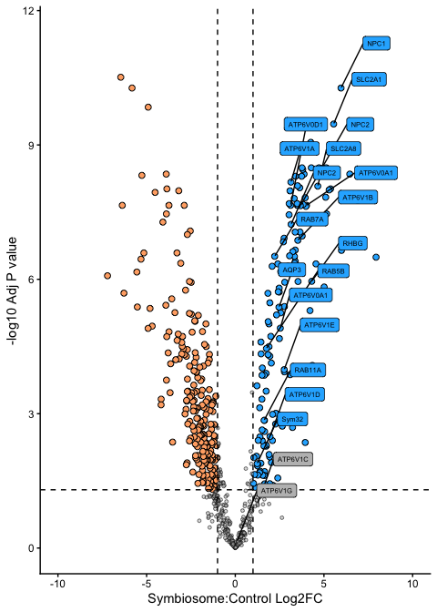<!-- -->

``` r
# PCA plots
PCAdata <- counts %>% dplyr::select("Protein.ID","CycLoess_Con1", "CycLoess_Con2", "CycLoess_Con3","CycLoess_Con4","CycLoess_Con5","CycLoess_Con6", "CycLoess_Sym1","CycLoess_Sym2","CycLoess_Sym3","CycLoess_Sym4","CycLoess_Sym5","CycLoess_Sym6")
PCAdata <- PCAdata %>% tidyr::drop_na()
PCAdata <- setNames(data.frame(t(PCAdata[,-1])), PCAdata[,1])
PCAdata <- PCAdata %>% 
  rownames_to_column(var = "ID")
PCAdata$Replicate <- c("1","2","3","1","2","3")
PCAdata$Treatment <- c("Control","Control","Control","Control","Control","Control","Symbiosome","Symbiosome", "Symbiosome","Symbiosome","Symbiosome", "Symbiosome")
PCAdata <- PCAdata %>% relocate("Replicate", .after="ID")
PCAdata <- PCAdata %>% relocate("Treatment", .before="Replicate")
PCAdata <- PCAdata%>% dplyr::select(-c("ID","Replicate"))
pca_res <- prcomp(PCAdata[,-1], scale. = TRUE)
PCi <-data.frame(pca_res$x,Treatment=PCAdata$Treatment)

pca_var <- pca_res$sdev^2
pca_var_pct <- round(pca_var / sum(pca_var) * 100, 2)

PC1_label <- paste0("PC1 (", pca_var_pct[1], "%)")
PC2_label <- paste0("PC2 (", pca_var_pct[2], "%)")

ggplot(PCi,aes(x=PC1,y=PC2,fill=Treatment))+
   geom_point(size=3, shape=21)+ # Size and alpha just for fun
   scale_fill_manual(values = c("#ffad73","#26b3ff"))+ # your colors here
  xlab(PC1_label) + ylab(PC2_label)+
  labs(fill = "Sample") +
  theme_classic() 
```

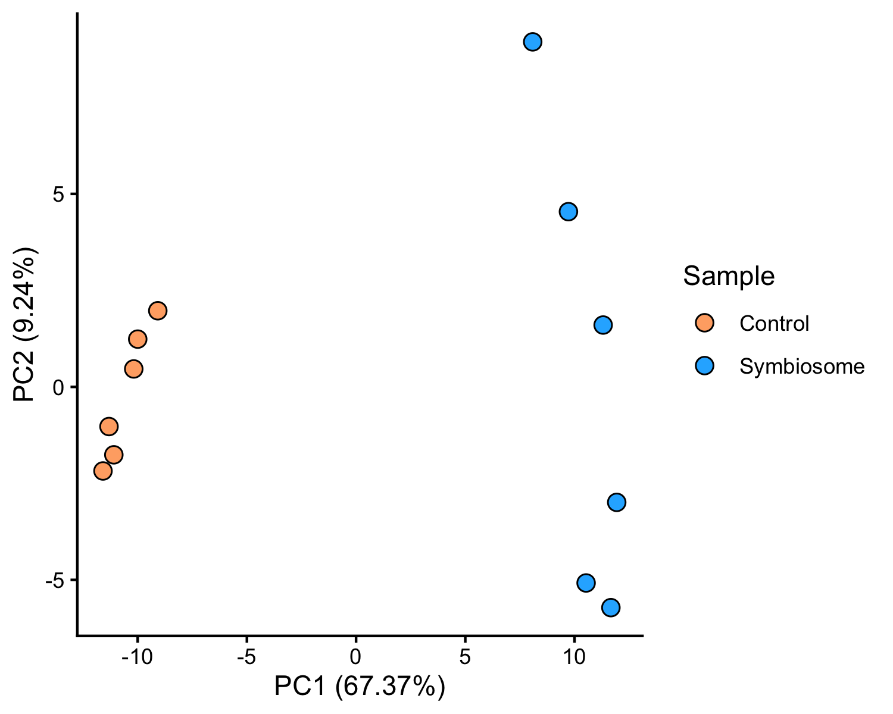<!-- -->

``` r
# Extract just Protein IDs for GO-term enrichment analysis
conenriched_AIPGENES <- countsconenriched[,"Protein.ID", drop=FALSE]
write.table(conenriched_AIPGENES, file="Aiptasia_Bmin_search_output/GO_Input/ConEnriched.txt", row.names=F, quote=F)

symenriched_AIPGENES <- countssymenriched[,"Protein.ID", drop=FALSE]
write.table(symenriched_AIPGENES, file="Aiptasia_Bmin_search_output/GO_Input/SymEnriched.txt", row.names=F, quote=F)
```

    ## [1] "Current file: ConEnriched.txt"

    ## [1] "Current file: SymEnriched.txt"

    ## [1] "Current file: ConEnriched.txt"

    ## [1] "Current file: SymEnriched.txt"

    ## [1] "Current file: ConEnriched.txt"

    ## [1] "Current file: SymEnriched.txt"

``` r
# Find top 10 most significantly enriched cell-compartment GO-terms with at least 5 significant terms.
cc_Symenriched <- read.table("Aiptasia_Bmin_search_output/GO_Output/cc_SymEnriched.txt",sep="\t",header=T)
cc_Symenriched <- cc_Symenriched%>% filter((P_value<=0.05)) %>% filter(Significant>=5)
cc_Symenriched <-head(n=10,cc_Symenriched)

cc_Conenriched <- read.table("Aiptasia_Bmin_search_output/GO_Output/cc_ConEnriched.txt",sep="\t",header=T)
cc_Conenriched$P_value <- as.numeric(ifelse(cc_Conenriched$P_value=="< 1e-30", 1*10^-30, cc_Conenriched$P_value))
cc_Conenriched <- cc_Conenriched%>% filter(P_value<=0.05) %>% filter(Significant>=5)
cc_Conenriched <-head(n=10,cc_Conenriched)

# Make figures for cell compartment GO-terms

CCplot_symenriched<-ggplot(cc_Symenriched, aes(x= reorder(Term, -P_value), y=-log10(P_value))) + 
  geom_bar(stat = "identity", width=0.5) +   scale_y_continuous(expand = expansion(mult = c(0, 0.05)))+
  coord_flip() +
  theme_classic()+theme(axis.text.x = element_text(angle = 90, vjust = 0.5, hjust=1)) + 
  labs(y="-log10(P-value)",x="", title="Symbiosome enriched")

CCplot_conenriched<-ggplot(cc_Conenriched, aes(x= reorder(Term, -P_value), y=-log10(P_value))) + 
  geom_bar(stat = "identity", width=0.5) +   scale_y_continuous(expand = expansion(mult = c(0, 0.05)))+
  coord_flip() +
  theme_classic()+theme(axis.text.x = element_text(angle = 90, vjust = 0.5, hjust=1)) + 
  labs(y="-log10(P-value)",x="", title="Control enriched")

allCCplots<- ggarrange(CCplot_conenriched, CCplot_symenriched,nrow=1, common.legend = TRUE, legend = "right")
allCCplots
```

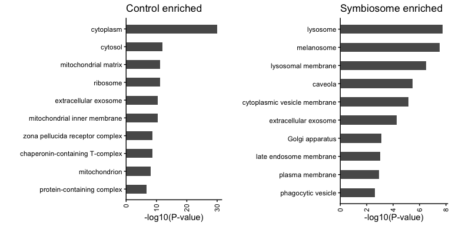<!-- -->

``` r
# Make figures for transmembrane protein analysis and RNAseq comparison
counts_vol$SAG <- ifelse(counts_vol$log2FoldChange_Sym0_Apo0>=1, "TRUE", "FALSE")
counts_vol$TM <- ifelse(counts_vol$TM_Helices>=1, "TRUE", "FALSE")

SAGsymcount <- length(which(counts_vol$Enrichment == "SymEnriched" & counts_vol$SAG=="TRUE"))
totalsymcount <- length(which(counts_vol$Enrichment=="SymEnriched"))
Percent_symSAG <- SAGsymcount/(totalsymcount)


SAGconcount <- length(which(counts_vol$Enrichment == "ConEnriched" & counts_vol$SAG=="TRUE"))
totalconcount <- length(which(counts_vol$Enrichment=="ConEnriched"))
Percent_conSAG <- SAGconcount/totalconcount

TMsymcount <- length(which(counts_vol$Enrichment == "SymEnriched" & counts_vol$TM=="TRUE"))
Percent_symTM <- TMsymcount/totalsymcount

TMconcount <- length(which(counts_vol$Enrichment == "ConEnriched" & counts_vol$TM=="TRUE"))
Percent_conTM <- TMconcount/totalconcount


SAG_TM_data <- data.frame(
  Enrichment = c("Control Enriched", "Symbiosome Enriched"),
  SAG = c(Percent_conSAG, Percent_symSAG),  #  fill in your counts
  TM = c(Percent_conTM, Percent_symTM)    #  fill in your counts
)


TMPercentplot <- ggplot(SAG_TM_data, aes(x=Enrichment, y=TM)) +
geom_bar(stat="identity", position=position_dodge()) +theme_classic() +
  scale_y_continuous(labels=scales::percent,limits=c(0,.3), expand = expansion(mult = c(0, 0.05))) + labs(x="") +
   geom_hline(yintercept = .193, color = "darkgray", linetype = "dashed") + ylab("Proteins with predicted \n transmembrane domains")

SAGPercentplot <- ggplot(SAG_TM_data, aes(x=Enrichment, y=SAG)) +
geom_bar(stat="identity", position=position_dodge()) +theme_classic() +
  scale_y_continuous(labels=scales::percent,limits=c(0,.21), expand = expansion(mult = c(0, 0.05))) + labs(x="")+
   geom_hline(yintercept = .045, color = "darkgray", linetype = "dashed") + ylab("Proteins that are transcriptionally \n upregulated with symbiosis")

ggarrange(TMPercentplot, SAGPercentplot)
```

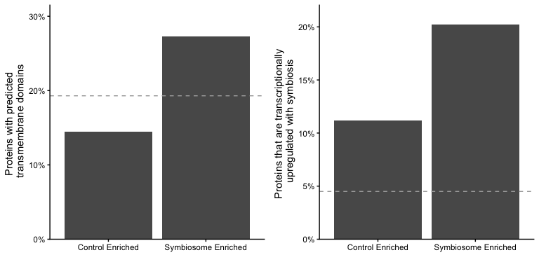<!-- -->

## Aiptasia only search with Breviolum minutum peptides removed

``` r
# Find all shared peptides between Aiptasia and Breviolum minutum
pepdata_aipbmin <- read.table("Inputs/combined_peptide_Aiptasia_and_Bmin.tsv", sep= "\t",  header=TRUE, quote="")
pepdata_aipbmin <- pepdata_aipbmin %>% filter(str_detect(Protein.ID,"symb")|str_detect(Mapped.Proteins,"symb"))

# Pull up Aiptasia-only search peptide results
pepdata_aiponly <- read.table("Inputs/combined_peptide_Aiptasia_only.tsv", sep= "\t",  header=TRUE, quote="")

# Remove peptides from Aiptasia-only search that are shared between Aiptasia and Breviolum minutum
Aipunique_peptides <- anti_join(pepdata_aiponly, pepdata_aipbmin, by = "Peptide.Sequence")

# Sum each peptide intensity to aggregate into proteins
sample_cols <- c(
  paste0("Control_", 1:6, ".Intensity"),
  paste0("Symbiosome_", 1:6, ".Intensity")
)

Aipunique_proteins <- Aipunique_peptides %>%
  group_by(Protein.ID) %>%
  summarise(
    n_peptides = n(),  # number of peptides per protein
    across(
      all_of(sample_cols),
      ~ sum(.x, na.rm = TRUE),  # sum ignoring NAs
      .names = "{.col}"
    ),
    .groups = "drop"
  )
```

``` r
# Extract Aiptasia proteins, removing contaminants
Aipunique_proteins <- Aipunique_proteins %>% filter(str_detect(Protein.ID, "^AIP"))

# Extract only intensity values for Normalyzer
Aipunique_proteins <- Aipunique_proteins %>% dplyr::select("Protein.ID","Symbiosome_1.Intensity","Symbiosome_2.Intensity","Symbiosome_3.Intensity","Symbiosome_4.Intensity","Symbiosome_5.Intensity","Symbiosome_6.Intensity","Control_1.Intensity","Control_2.Intensity","Control_3.Intensity","Control_4.Intensity","Control_5.Intensity","Control_6.Intensity")

# Write table into file
write.table(Aipunique_proteins, file="Aiptasia_only_search_Bmin_removed_output/Aiptasia_only_proteins.tsv", sep="\t", row.names=F, quote=F)
```

``` r
# Use Normalyzer on curated data
outDir <- "Aiptasia_only_search_Bmin_removed_output"
designFp <- "Inputs/Normalyzermatrix.tsv"
dataFp <- "Aiptasia_only_search_Bmin_removed_output/Aiptasia_only_proteins.tsv"
normalyzer(jobName="vignette_run_Aipnorm", designPath=designFp, dataPath=dataFp, outputDir=outDir)
```

``` r
# Perform statistical analysis using Normalyzer on Cyclic Loess normalized data
normMatrixPath <- paste(outDir, "vignette_run_Aipnorm/CycLoess-normalized.txt", sep="/")
normalyzerDE("vignette_run_Aipnorm",
  comparisons=c("Control-Symbiosome"),
  designPath=designFp,
  dataPath=normMatrixPath,
  outputDir=outDir,
  condCol="group")
```

    ## [1] "Setting up statistics object"
    ## [1] "Calculating statistical contrasts..."
    ## [1] "Contrast calculations done!"
    ## [1] "Writing 2151 annotated rows to Aiptasia_only_search_Bmin_removed_output/vignette_run_Aipnorm/vignette_run_Aipnorm_stats.tsv"
    ## [1] "Writing statistics report"

    ## [1] "All done! Results are stored in: Aiptasia_only_search_Bmin_removed_output/vignette_run_Aipnorm, processing time was 0 minutes"

``` r
# Rename spreadsheet
CycLoess_Aiponly <- read.table("Aiptasia_only_search_Bmin_removed_output/vignette_run_Aipnorm/vignette_run_Aipnorm_stats.tsv", sep="\t", header=TRUE)
CycLoess_Aiponly <- CycLoess_Aiponly %>% rename("CycLoess_Con1"="Control_1.Intensity")
CycLoess_Aiponly <- CycLoess_Aiponly %>% rename("CycLoess_Con2"="Control_2.Intensity")
CycLoess_Aiponly <- CycLoess_Aiponly %>% rename("CycLoess_Con3"="Control_3.Intensity")
CycLoess_Aiponly <- CycLoess_Aiponly %>% rename("CycLoess_Con4"="Control_4.Intensity")
CycLoess_Aiponly <- CycLoess_Aiponly %>% rename("CycLoess_Con5"="Control_5.Intensity")
CycLoess_Aiponly <- CycLoess_Aiponly %>% rename("CycLoess_Con6"="Control_6.Intensity")
CycLoess_Aiponly <- CycLoess_Aiponly %>% rename("CycLoess_Sym1"="Symbiosome_1.Intensity")
CycLoess_Aiponly <- CycLoess_Aiponly %>% rename("CycLoess_Sym2"="Symbiosome_2.Intensity")
CycLoess_Aiponly <- CycLoess_Aiponly %>% rename("CycLoess_Sym3"="Symbiosome_3.Intensity")
CycLoess_Aiponly <- CycLoess_Aiponly %>% rename("CycLoess_Sym4"="Symbiosome_4.Intensity")
CycLoess_Aiponly <- CycLoess_Aiponly %>% rename("CycLoess_Sym5"="Symbiosome_5.Intensity")
CycLoess_Aiponly <- CycLoess_Aiponly %>% rename("CycLoess_Sym6"="Symbiosome_6.Intensity")

# Merge with annotations
Annotations <- read.table("Inputs/aiptasia_genome.annot.tsv",quote="", sep="\t", header=TRUE)
Annotated_proteome <- left_join(CycLoess_Aiponly, Annotations, by=c("Protein.ID"="Query"))

# Merge with Apo/Sym RNAseq from Cleves et al. 2020 PNAS data 
RNAseq <- read_excel("Inputs/symbiosis_associated_genes.xlsx", skip = 2)
RNAseq <- RNAseq %>% dplyr::select(Aipgenes, log2FoldChange_Sym0_Apo0, padj_Sym0_Apo0)
Annotated_proteome_RNAseq <- left_join(Annotated_proteome, RNAseq, by=c("Protein.ID"="Aipgenes"))

# Add TM annotation from TMHMM2.0 prediction
TM_Aipgene <- read.table("Inputs/TMHMM_Aiptasia_genome_output.tsv", sep='\t')
Annotated_proteome_RNAseq_TM <- left_join(Annotated_proteome_RNAseq, TM_Aipgene[,c("V1","V5")], by=c("Protein.ID"="V1"))
Annotated_proteome_RNAseq_TM <- Annotated_proteome_RNAseq_TM %>% rename("TM_Helices"="V5")
Annotated_proteome_RNAseq_TM$TM_Helices <- str_extract(Annotated_proteome_RNAseq_TM$TM_Helices, '\\d+')
```

``` r
# Find significantly enriched proteins
counts <- Annotated_proteome_RNAseq_TM

# Create new categorical column 
counts <- counts %>%
  mutate(Enrichment = case_when(Control.Symbiosome_log2FoldChange >= 1 & Control.Symbiosome_AdjPVal <= 0.05 ~ "ConEnriched",
                               Control.Symbiosome_log2FoldChange <= -1 & Control.Symbiosome_AdjPVal <= 0.05 ~ "SymEnriched",
                               TRUE ~ "NS"))

# Pull out Symbiosome-enriched proteins
countssymenriched=counts %>%
  filter(Enrichment=="SymEnriched") %>% arrange(Control.Symbiosome_log2FoldChange)

# Remove symbiosome-enriched proteins found in less than 3 samples.
countssymenriched <- countssymenriched %>%
 filter((!is.na(CycLoess_Sym1)) + (!is.na(CycLoess_Sym2)) + (!is.na(CycLoess_Sym3)) + (!is.na(CycLoess_Sym4)) + (!is.na(CycLoess_Sym5)) + (!is.na(CycLoess_Sym6)) >= 3)

# Find Unique genes in Sym -This is only unique proteins that are found in at least 3 sym samples and not in any of the controls.
CountsnotinCon <- counts %>%
  filter((is.na(CycLoess_Con1)) + (is.na(CycLoess_Con2)) + (is.na(CycLoess_Con3)) + (is.na(CycLoess_Con4)) + (is.na(CycLoess_Con5)) + (is.na(CycLoess_Con6)) == 6)
CountsnotinCon_Sym <- CountsnotinCon %>%
  filter((!is.na(CycLoess_Sym1)) + (!is.na(CycLoess_Sym2)) + (!is.na(CycLoess_Sym3)) + (!is.na(CycLoess_Sym4)) + (!is.na(CycLoess_Sym5)) + (!is.na(CycLoess_Sym6)) >= 3)

# Combined dataframes countssymenriched with the unique genes
countssymenriched <- rbind(countssymenriched,CountsnotinCon_Sym)
countssymenriched$Enrichment <- "SymEnriched"
# Write csv file
write.csv(countssymenriched,file="Aiptasia_only_search_Bmin_removed_output/Symbiosome_enriched_proteins.csv", row.names=F)

# Pull out Control-enriched proteins
countsconenriched <- counts %>%
  filter(Enrichment=="ConEnriched") %>% arrange(Control.Symbiosome_log2FoldChange)

# Remove control-enriched proteins found in less than 3 samples.
countsconenriched <- countsconenriched %>%
  filter((!is.na(CycLoess_Con1)) + (!is.na(CycLoess_Con2)) + (!is.na(CycLoess_Con3)) + (!is.na(CycLoess_Con4)) + (!is.na(CycLoess_Con5)) + (!is.na(CycLoess_Con6)) >= 3)

# Find Unique proteins in con -This is only unique proteins that are found in at least 3 con samples and not in any of the symbiosome.
CountsinCon <- counts %>%
  filter((!is.na(CycLoess_Con1)) + (!is.na(CycLoess_Con2)) + (!is.na(CycLoess_Con3)) + (!is.na(CycLoess_Con4)) + (!is.na(CycLoess_Con5)) + (!is.na(CycLoess_Con6)) >= 3)
CountsinCon_notinSym=CountsinCon %>%
  filter((is.na(CycLoess_Sym1)) + (is.na(CycLoess_Sym2)) + (is.na(CycLoess_Sym3)) + (is.na(CycLoess_Sym4)) + (is.na(CycLoess_Sym5)) + (is.na(CycLoess_Sym6)) == 6)

# Combined dataframes countsconenriched with the unique genes
countsconenriched <- rbind(countsconenriched,CountsinCon_notinSym)
countsconenriched$Enrichment <- "ConEnriched"

# Write csv
write.csv(countsconenriched,file="Aiptasia_only_search_Bmin_removed_output/Control_enriched_proteins.csv", row.names=F)
```

``` r
# Volcano plot
cols <- c("ConEnriched" = "#ffad73", "SymEnriched" = "#26b3ff", "NS" = "grey") 
sizes <- c("ConEnriched" = 2, "SymEnriched" = 2, "NS" = 1) 
alphas <- c("ConEnriched" = 1, "SymEnriched" = 1, "NS" = 0.5)
counts_noNSig <- counts %>% filter(Enrichment == "NS")
counts_vol <- rbind(countssymenriched, countsconenriched, counts_noNSig)

Known_genes <- read.csv("Inputs/Known_symbiosome_genes.csv",header=T)

counts_vol_known<-left_join(counts_vol,Known_genes,by=c("Protein.ID"="AIPGENE"))


vol_plot_known <- counts_vol_known %>%
  ggplot(aes(x = -Control.Symbiosome_log2FoldChange,
             y = -log10(Control.Symbiosome_AdjPVal),
             fill = Enrichment,    
             size = Enrichment,
             alpha = Enrichment,
             label = GENE)) +
  theme_classic() +
   geom_point(shape=21, show.legend=F) +
    scale_fill_manual(values = cols, name="Expression") + # Modify point colour
    scale_size_manual(values = sizes, name="Expression") + # Modify point size
    scale_alpha_manual(values = alphas, name="Expression") +
  labs(x="Symbiosome:Control Log2FC", y="-log10 Adj P value")+
  geom_hline(yintercept = -log10(0.05), linetype = "dashed") +
  geom_vline(xintercept = c(-1, 1), linetype = "dashed") +
  xlim(-10,10) + geom_label_repel(show.legend=F,size=2,alpha=1,max.overlaps = Inf, aes(),
    position = position_nudge_repel(x=2,y = 1),box.padding=0.3)
vol_plot_known
```

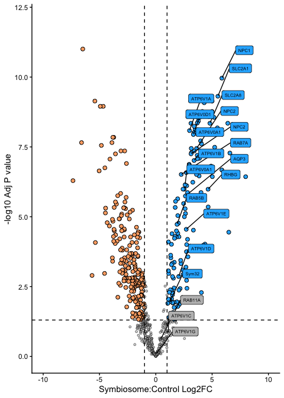<!-- -->

``` r
# PCA plots
PCAdata <- counts %>% dplyr::select("Protein.ID","CycLoess_Con1", "CycLoess_Con2", "CycLoess_Con3","CycLoess_Con4","CycLoess_Con5","CycLoess_Con6", "CycLoess_Sym1","CycLoess_Sym2","CycLoess_Sym3","CycLoess_Sym4","CycLoess_Sym5","CycLoess_Sym6")
PCAdata <- PCAdata %>% tidyr::drop_na()
PCAdata <- setNames(data.frame(t(PCAdata[,-1])), PCAdata[,1])
PCAdata <- PCAdata %>% 
  rownames_to_column(var = "ID")
PCAdata$Replicate <- c("1","2","3","1","2","3")
PCAdata$Treatment <- c("Control","Control","Control","Control","Control","Control","Symbiosome","Symbiosome", "Symbiosome","Symbiosome","Symbiosome", "Symbiosome")
PCAdata <- PCAdata %>% relocate("Replicate", .after="ID")
PCAdata <- PCAdata %>% relocate("Treatment", .before="Replicate")
PCAdata <- PCAdata%>% dplyr::select(-c("ID","Replicate"))
pca_res <- prcomp(PCAdata[,-1], scale. = TRUE)
PCi <-data.frame(pca_res$x,Treatment=PCAdata$Treatment)

pca_var <- pca_res$sdev^2
pca_var_pct <- round(pca_var / sum(pca_var) * 100, 2)

PC1_label <- paste0("PC1 (", pca_var_pct[1], "%)")
PC2_label <- paste0("PC2 (", pca_var_pct[2], "%)")

ggplot(PCi,aes(x=PC1,y=PC2,fill=Treatment))+
   geom_point(size=3, shape=21)+ #Size and alpha just for fun
   scale_fill_manual(values = c("#ffad73","#26b3ff"))+ #your colors here
  xlab(PC1_label) + ylab(PC2_label)+
  labs(fill = "Sample") +
  theme_classic() 
```

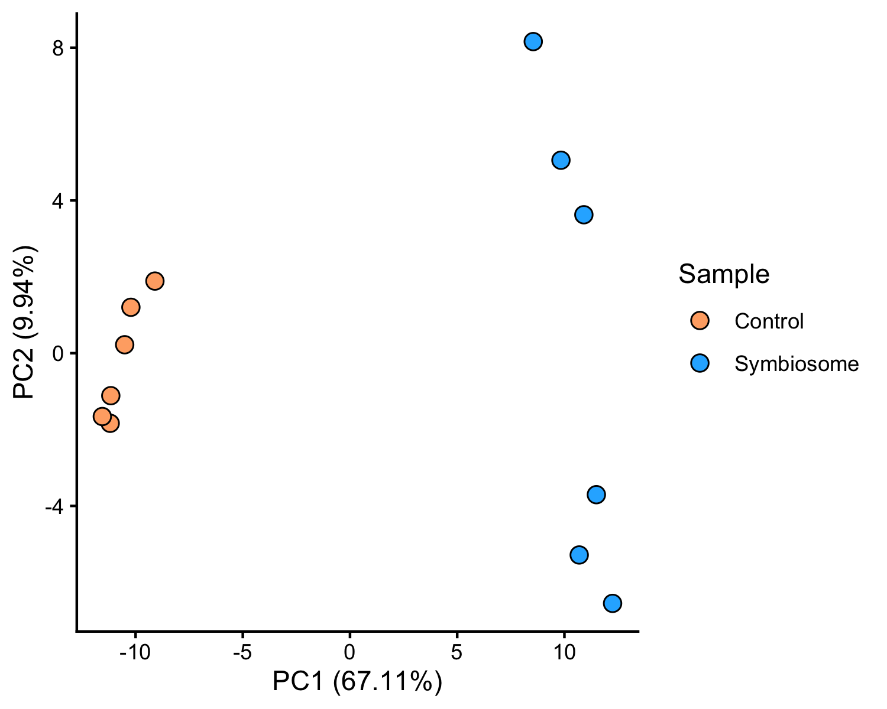<!-- -->

``` r
# Extract just Protein IDs for GO-term enrichment analysis
conenriched_AIPGENES <- countsconenriched[,"Protein.ID", drop=FALSE]
write.table(conenriched_AIPGENES, file="Aiptasia_only_search_Bmin_removed_output/GO_Input/ConEnriched.txt", row.names=F, quote=F)

symenriched_AIPGENES <- countssymenriched[,"Protein.ID", drop=FALSE]
write.table(symenriched_AIPGENES, file="Aiptasia_only_search_Bmin_removed_output/GO_Input/SymEnriched.txt", row.names=F, quote=F)
```

    ## [1] "Current file: ConEnriched.txt"

    ## [1] "Current file: SymEnriched.txt"

    ## [1] "Current file: ConEnriched.txt"

    ## [1] "Current file: SymEnriched.txt"

    ## [1] "Current file: ConEnriched.txt"

    ## [1] "Current file: SymEnriched.txt"

``` r
# Find top 10 most significantly enriched cell-compartment GO-terms with at least 5 significant terms
cc_Symenriched <- read.table("Aiptasia_only_search_Bmin_removed_output/GO_Output/cc_SymEnriched.txt",sep="\t",header=T)
cc_Symenriched <- cc_Symenriched%>% filter((P_value<=0.05)) %>% filter(Significant>=5)
cc_Symenriched <-head(n=10,cc_Symenriched)

cc_Conenriched <- read.table("Aiptasia_only_search_Bmin_removed_output/GO_Output/cc_ConEnriched.txt",sep="\t",header=T)
cc_Conenriched$P_value <- as.numeric(ifelse(cc_Conenriched$P_value=="< 1e-30", 1*10^-30, cc_Conenriched$P_value))
cc_Conenriched <- cc_Conenriched%>% filter(P_value<=0.05) %>% filter(Significant>=5)
cc_Conenriched <-head(n=10,cc_Conenriched)
```

``` r
# Make figures for cell compartment GO-terms

CCplot_symenriched<-ggplot(cc_Symenriched, aes(x= reorder(Term, -P_value), y=-log10(P_value))) + 
  geom_bar(stat = "identity", width=0.5) +   scale_y_continuous(expand = expansion(mult = c(0, 0.05)))+
  coord_flip() +
  theme_classic()+theme(axis.text.x = element_text(angle = 90, vjust = 0.5, hjust=1)) + 
  labs(y="-log10(P-value)",x="", title="Symbiosome enriched")

CCplot_conenriched<-ggplot(cc_Conenriched, aes(x= reorder(Term, -P_value), y=-log10(P_value))) + 
  geom_bar(stat = "identity", width=0.5) +   scale_y_continuous(expand = expansion(mult = c(0, 0.05)))+
  coord_flip() +
  theme_classic()+theme(axis.text.x = element_text(angle = 90, vjust = 0.5, hjust=1)) + 
  labs(y="-log10(P-value)",x="", title="Control enriched")

allCCplots<- ggarrange(CCplot_conenriched, CCplot_symenriched,nrow=1, common.legend = TRUE, legend = "right")
allCCplots
```

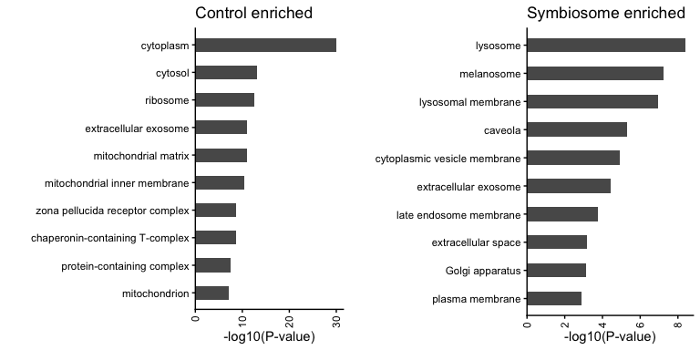<!-- -->

``` r
#Make figures for transmembrane protein analysis and RNAseq comparison
counts_vol$SAG <- ifelse(counts_vol$log2FoldChange_Sym0_Apo0>=1, "TRUE", "FALSE")
counts_vol$TM <- ifelse(counts_vol$TM_Helices>=1, "TRUE", "FALSE")

SAGsymcount <- length(which(counts_vol$Enrichment == "SymEnriched" & counts_vol$SAG=="TRUE"))
totalsymcount <- length(which(counts_vol$Enrichment=="SymEnriched"))
Percent_symSAG <- SAGsymcount/(totalsymcount)


SAGconcount <- length(which(counts_vol$Enrichment == "ConEnriched" & counts_vol$SAG=="TRUE"))
totalconcount <- length(which(counts_vol$Enrichment=="ConEnriched"))
Percent_conSAG <- SAGconcount/totalconcount

TMsymcount <- length(which(counts_vol$Enrichment == "SymEnriched" & counts_vol$TM=="TRUE"))
Percent_symTM <- TMsymcount/totalsymcount

TMconcount <- length(which(counts_vol$Enrichment == "ConEnriched" & counts_vol$TM=="TRUE"))
Percent_conTM <- TMconcount/totalconcount


SAG_TM_data <- data.frame(
  Enrichment = c("Control Enriched", "Symbiosome Enriched"),
  SAG = c(Percent_conSAG, Percent_symSAG),  # fill in your counts
  TM = c(Percent_conTM, Percent_symTM)    # fill in your counts
)


TMPercentplot <- ggplot(SAG_TM_data, aes(x=Enrichment, y=TM)) +
geom_bar(stat="identity", position=position_dodge()) +theme_classic() +
  scale_y_continuous(labels=scales::percent,limits=c(0,.31), expand = expansion(mult = c(0, 0.05))) + labs(x="") +
   geom_hline(yintercept = .193, color = "darkgray", linetype = "dashed") + ylab("Proteins with predicted \n transmembrane domains")

SAGPercentplot <- ggplot(SAG_TM_data, aes(x=Enrichment, y=SAG)) +
geom_bar(stat="identity", position=position_dodge()) +theme_classic() +
  scale_y_continuous(labels=scales::percent,limits=c(0,.2), expand = expansion(mult = c(0, 0.05))) + labs(x="")+
   geom_hline(yintercept = .045, color = "darkgray", linetype = "dashed") + ylab("Proteins that are transcriptionally \n upregulated with symbiosis")

ggarrange(TMPercentplot, SAGPercentplot)
```

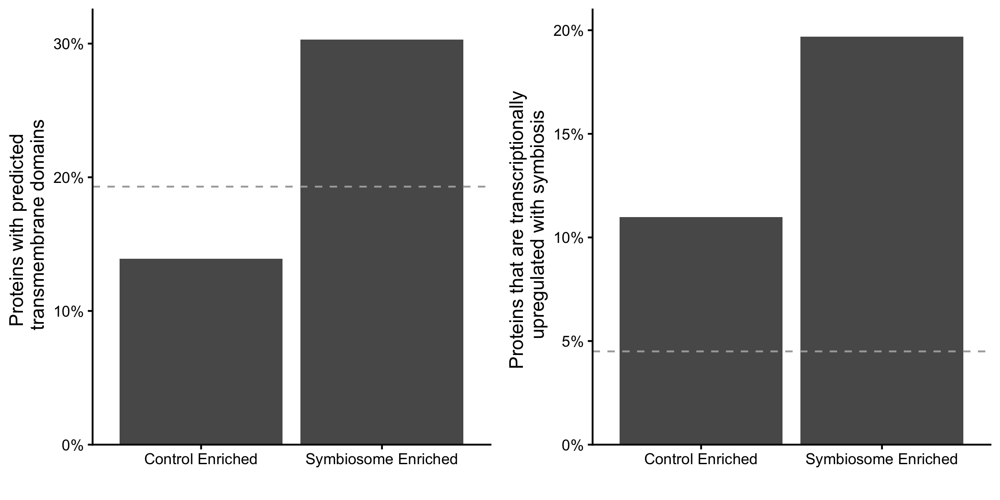<!-- -->

## Aiptasia and Breviolum minutum combined search with Breviolum minutum peptides removed

``` r
# Find all shared peptides between Aiptasia and Breviolum minutum
pepdata_aipbmin <- read.table("Inputs/combined_peptide_Aiptasia_and_Bmin.tsv", sep= "\t",  header=TRUE, quote="")
pepdata_aipbmin_shared <- pepdata_aipbmin %>% filter(str_detect(Protein.ID,"symb")|str_detect(Mapped.Proteins,"symb"))

# Remove peptides from Aiptasia-only search that are shared between Aiptasia and Breviolum minutum
Aipunique_peptides <- anti_join(pepdata_aipbmin, pepdata_aipbmin_shared, by = "Peptide.Sequence")

# Sum each peptide intensity to aggregate into proteins
sample_cols <- c(
  paste0("Control_", 1:6, ".Intensity"),
  paste0("Symbiosome_", 1:6, ".Intensity")
)

Aipunique_proteins <- Aipunique_peptides %>%
  group_by(Protein.ID) %>%
  summarise(
    n_peptides = n(),  # number of peptides per protein
    across(
      all_of(sample_cols),
      ~ sum(.x, na.rm = TRUE),  # sum ignoring NAs
      .names = "{.col}"
    ),
    .groups = "drop"
  )
```

``` r
# Extract Aiptasia proteins, removing contaminants
Aipunique_proteins <- Aipunique_proteins %>% filter(str_detect(Protein.ID, "^AIP"))

# Extract only intensity values for Normalyzer
Aipunique_proteins <- Aipunique_proteins %>% dplyr::select("Protein.ID","Symbiosome_1.Intensity","Symbiosome_2.Intensity","Symbiosome_3.Intensity","Symbiosome_4.Intensity","Symbiosome_5.Intensity","Symbiosome_6.Intensity","Control_1.Intensity","Control_2.Intensity","Control_3.Intensity","Control_4.Intensity","Control_5.Intensity","Control_6.Intensity")

# Write table into file
write.table(Aipunique_proteins, file="Aiptasia_Bmin_search_Bmin_removed_output/Aiptasia_only_proteins.tsv", sep="\t", row.names=F, quote=F)
```

``` r
# Use Normalyzer on curated data
outDir <- "Aiptasia_Bmin_search_Bmin_removed_output"
designFp <- "Inputs/Normalyzermatrix.tsv"
dataFp <- "Aiptasia_Bmin_search_Bmin_removed_output/Aiptasia_only_proteins.tsv"
normalyzer(jobName="vignette_run_Aipnorm", designPath=designFp, dataPath=dataFp, outputDir=outDir)
```

``` r
# Perform statistical analysis using Normalyzer on Cyclic Loess normalized data
normMatrixPath <- paste(outDir, "vignette_run_Aipnorm/CycLoess-normalized.txt", sep="/")
normalyzerDE("vignette_run_Aipnorm",
  comparisons=c("Control-Symbiosome"),
  designPath=designFp,
  dataPath=normMatrixPath,
  outputDir=outDir,
  condCol="group")
```

    ## [1] "Setting up statistics object"
    ## [1] "Calculating statistical contrasts..."
    ## [1] "Contrast calculations done!"
    ## [1] "Writing 2032 annotated rows to Aiptasia_Bmin_search_Bmin_removed_output/vignette_run_Aipnorm/vignette_run_Aipnorm_stats.tsv"
    ## [1] "Writing statistics report"

    ## [1] "All done! Results are stored in: Aiptasia_Bmin_search_Bmin_removed_output/vignette_run_Aipnorm, processing time was 0 minutes"

``` r
# Rename spreadsheet
CycLoess_Aiponly <- read.table("Aiptasia_Bmin_search_Bmin_removed_output/vignette_run_Aipnorm/vignette_run_Aipnorm_stats.tsv", sep="\t", header=TRUE)
CycLoess_Aiponly <- CycLoess_Aiponly %>% rename("CycLoess_Con1"="Control_1.Intensity")
CycLoess_Aiponly <- CycLoess_Aiponly %>% rename("CycLoess_Con2"="Control_2.Intensity")
CycLoess_Aiponly <- CycLoess_Aiponly %>% rename("CycLoess_Con3"="Control_3.Intensity")
CycLoess_Aiponly <- CycLoess_Aiponly %>% rename("CycLoess_Con4"="Control_4.Intensity")
CycLoess_Aiponly <- CycLoess_Aiponly %>% rename("CycLoess_Con5"="Control_5.Intensity")
CycLoess_Aiponly <- CycLoess_Aiponly %>% rename("CycLoess_Con6"="Control_6.Intensity")
CycLoess_Aiponly <- CycLoess_Aiponly %>% rename("CycLoess_Sym1"="Symbiosome_1.Intensity")
CycLoess_Aiponly <- CycLoess_Aiponly %>% rename("CycLoess_Sym2"="Symbiosome_2.Intensity")
CycLoess_Aiponly <- CycLoess_Aiponly %>% rename("CycLoess_Sym3"="Symbiosome_3.Intensity")
CycLoess_Aiponly <- CycLoess_Aiponly %>% rename("CycLoess_Sym4"="Symbiosome_4.Intensity")
CycLoess_Aiponly <- CycLoess_Aiponly %>% rename("CycLoess_Sym5"="Symbiosome_5.Intensity")
CycLoess_Aiponly <- CycLoess_Aiponly %>% rename("CycLoess_Sym6"="Symbiosome_6.Intensity")

# Merge with annotations
Annotations <- read.table("Inputs/aiptasia_genome.annot.tsv",quote="", sep="\t", header=TRUE)
Annotated_proteome <- left_join(CycLoess_Aiponly, Annotations, by=c("Protein.ID"="Query"))

# Merge with Apo/Sym RNAseq from Cleves et al. 2020 PNAS data 
RNAseq <- read_excel("Inputs/symbiosis_associated_genes.xlsx", skip = 2)
RNAseq <- RNAseq %>% dplyr::select(Aipgenes, log2FoldChange_Sym0_Apo0, padj_Sym0_Apo0)
Annotated_proteome_RNAseq <- left_join(Annotated_proteome, RNAseq, by=c("Protein.ID"="Aipgenes"))

# Add TM annotation from TMHMM2.0 prediction
TM_Aipgene <- read.table("Inputs/TMHMM_Aiptasia_genome_output.tsv", sep='\t')
Annotated_proteome_RNAseq_TM <- left_join(Annotated_proteome_RNAseq, TM_Aipgene[,c("V1","V5")], by=c("Protein.ID"="V1"))
Annotated_proteome_RNAseq_TM <- Annotated_proteome_RNAseq_TM %>% rename("TM_Helices"="V5")
Annotated_proteome_RNAseq_TM$TM_Helices <- str_extract(Annotated_proteome_RNAseq_TM$TM_Helices, '\\d+')
```

``` r
# Find significantly enriched proteins
counts <- Annotated_proteome_RNAseq_TM

# Create new categorical column 
counts <- counts %>%
  mutate(Enrichment = case_when(Control.Symbiosome_log2FoldChange >= 1 & Control.Symbiosome_AdjPVal <= 0.05 ~ "ConEnriched",
                               Control.Symbiosome_log2FoldChange <= -1 & Control.Symbiosome_AdjPVal <= 0.05 ~ "SymEnriched",
                               TRUE ~ "NS"))

# Pull out Symbiosome-enriched proteins
countssymenriched=counts %>%
  filter(Enrichment=="SymEnriched") %>% arrange(Control.Symbiosome_log2FoldChange)

# Remove symbiosome-enriched proteins found in less than 3 samples.
countssymenriched <- countssymenriched %>%
 filter((!is.na(CycLoess_Sym1)) + (!is.na(CycLoess_Sym2)) + (!is.na(CycLoess_Sym3)) + (!is.na(CycLoess_Sym4)) + (!is.na(CycLoess_Sym5)) + (!is.na(CycLoess_Sym6)) >= 3)

# Find Unique genes in Sym -This is only unique proteins that are found in at least 3 sym samples and not in any of the controls.
CountsnotinCon <- counts %>%
  filter((is.na(CycLoess_Con1)) + (is.na(CycLoess_Con2)) + (is.na(CycLoess_Con3)) + (is.na(CycLoess_Con4)) + (is.na(CycLoess_Con5)) + (is.na(CycLoess_Con6)) == 6)
CountsnotinCon_Sym <- CountsnotinCon %>%
  filter((!is.na(CycLoess_Sym1)) + (!is.na(CycLoess_Sym2)) + (!is.na(CycLoess_Sym3)) + (!is.na(CycLoess_Sym4)) + (!is.na(CycLoess_Sym5)) + (!is.na(CycLoess_Sym6)) >= 3)

# Combined dataframes countssymenriched with the unique genes
countssymenriched <- rbind(countssymenriched,CountsnotinCon_Sym)
countssymenriched$Enrichment <- "SymEnriched"
# Write csv file
write.csv(countssymenriched,file="Aiptasia_Bmin_search_Bmin_removed_output/Symbiosome_enriched_proteins.csv", row.names=F)

# Pull out Control-enriched proteins
countsconenriched <- counts %>%
  filter(Enrichment=="ConEnriched") %>% arrange(Control.Symbiosome_log2FoldChange)

# Remove control-enriched proteins found in less than 3 samples.
countsconenriched <- countsconenriched %>%
  filter((!is.na(CycLoess_Con1)) + (!is.na(CycLoess_Con2)) + (!is.na(CycLoess_Con3)) + (!is.na(CycLoess_Con4)) + (!is.na(CycLoess_Con5)) + (!is.na(CycLoess_Con6)) >= 3)

# Find Unique proteins in con -This is only unique proteins that are found in at least 3 con samples and not in any of the symbiosome.
CountsinCon <- counts %>%
  filter((!is.na(CycLoess_Con1)) + (!is.na(CycLoess_Con2)) + (!is.na(CycLoess_Con3)) + (!is.na(CycLoess_Con4)) + (!is.na(CycLoess_Con5)) + (!is.na(CycLoess_Con6)) >= 3)
CountsinCon_notinSym=CountsinCon %>%
  filter((is.na(CycLoess_Sym1)) + (is.na(CycLoess_Sym2)) + (is.na(CycLoess_Sym3)) + (is.na(CycLoess_Sym4)) + (is.na(CycLoess_Sym5)) + (is.na(CycLoess_Sym6)) == 6)

# Combined dataframes countsconenriched with the unique genes
countsconenriched <- rbind(countsconenriched,CountsinCon_notinSym)
countsconenriched$Enrichment <- "ConEnriched"

# Write csv
write.csv(countsconenriched,file="Aiptasia_Bmin_search_Bmin_removed_output/Control_enriched_proteins.csv", row.names=F)
```

``` r
# Volcano plot
cols <- c("ConEnriched" = "#ffad73", "SymEnriched" = "#26b3ff", "NS" = "grey") 
sizes <- c("ConEnriched" = 2, "SymEnriched" = 2, "NS" = 1) 
alphas <- c("ConEnriched" = 1, "SymEnriched" = 1, "NS" = 0.5)
counts_noNSig <- counts %>% filter(Enrichment == "NS")
counts_vol <- rbind(countssymenriched, countsconenriched, counts_noNSig)

Known_genes <- read.csv("Inputs/Known_symbiosome_genes.csv",header=T)

counts_vol_known<-left_join(counts_vol,Known_genes,by=c("Protein.ID"="AIPGENE"))


vol_plot_known <- counts_vol_known %>%
  ggplot(aes(x = -Control.Symbiosome_log2FoldChange,
             y = -log10(Control.Symbiosome_AdjPVal),
             fill = Enrichment,    
             size = Enrichment,
             alpha = Enrichment,
             label = GENE)) +
  theme_classic() +
   geom_point(shape=21, show.legend=F) +
    scale_fill_manual(values = cols, name="Expression") + # Modify point colour
    scale_size_manual(values = sizes, name="Expression") + # Modify point size
    scale_alpha_manual(values = alphas, name="Expression") +
  labs(x="Symbiosome:Control Log2FC", y="-log10 Adj P value")+
  geom_hline(yintercept = -log10(0.05), linetype = "dashed") +
  geom_vline(xintercept = c(-1, 1), linetype = "dashed") +
  xlim(-10,10) + geom_label_repel(show.legend=F,size=2,alpha=1,max.overlaps = Inf, aes(),
    position = position_nudge_repel(x=2,y = 1),box.padding=0.3)
vol_plot_known
```

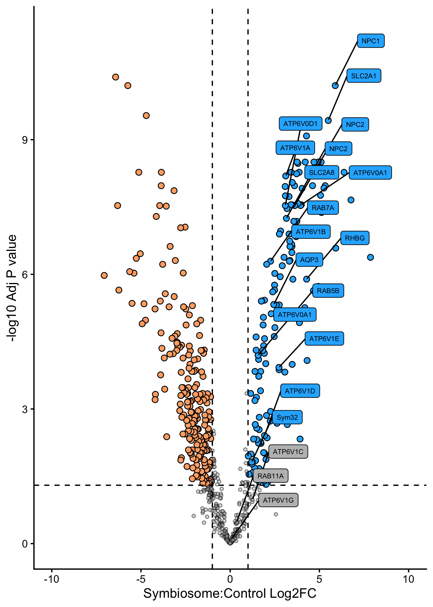<!-- -->

``` r
# PCA plots
PCAdata <- counts %>% dplyr::select("Protein.ID","CycLoess_Con1", "CycLoess_Con2", "CycLoess_Con3","CycLoess_Con4","CycLoess_Con5","CycLoess_Con6", "CycLoess_Sym1","CycLoess_Sym2","CycLoess_Sym3","CycLoess_Sym4","CycLoess_Sym5","CycLoess_Sym6")
PCAdata <- PCAdata %>% tidyr::drop_na()
PCAdata <- setNames(data.frame(t(PCAdata[,-1])), PCAdata[,1])
PCAdata <- PCAdata %>% 
  rownames_to_column(var = "ID")
PCAdata$Replicate <- c("1","2","3","1","2","3")
PCAdata$Treatment <- c("Control","Control","Control","Control","Control","Control","Symbiosome","Symbiosome", "Symbiosome","Symbiosome","Symbiosome", "Symbiosome")
PCAdata <- PCAdata %>% relocate("Replicate", .after="ID")
PCAdata <- PCAdata %>% relocate("Treatment", .before="Replicate")
PCAdata <- PCAdata%>% dplyr::select(-c("ID","Replicate"))
pca_res <- prcomp(PCAdata[,-1], scale. = TRUE)
PCi <-data.frame(pca_res$x,Treatment=PCAdata$Treatment)

pca_var <- pca_res$sdev^2
pca_var_pct <- round(pca_var / sum(pca_var) * 100, 2)

PC1_label <- paste0("PC1 (", pca_var_pct[1], "%)")
PC2_label <- paste0("PC2 (", pca_var_pct[2], "%)")

ggplot(PCi,aes(x=PC1,y=PC2,fill=Treatment))+
   geom_point(size=3, shape=21)+ #Size and alpha just for fun
   scale_fill_manual(values = c("#ffad73","#26b3ff"))+ #your colors here
  xlab(PC1_label) + ylab(PC2_label)+
  labs(fill = "Sample") +
  theme_classic() 
```

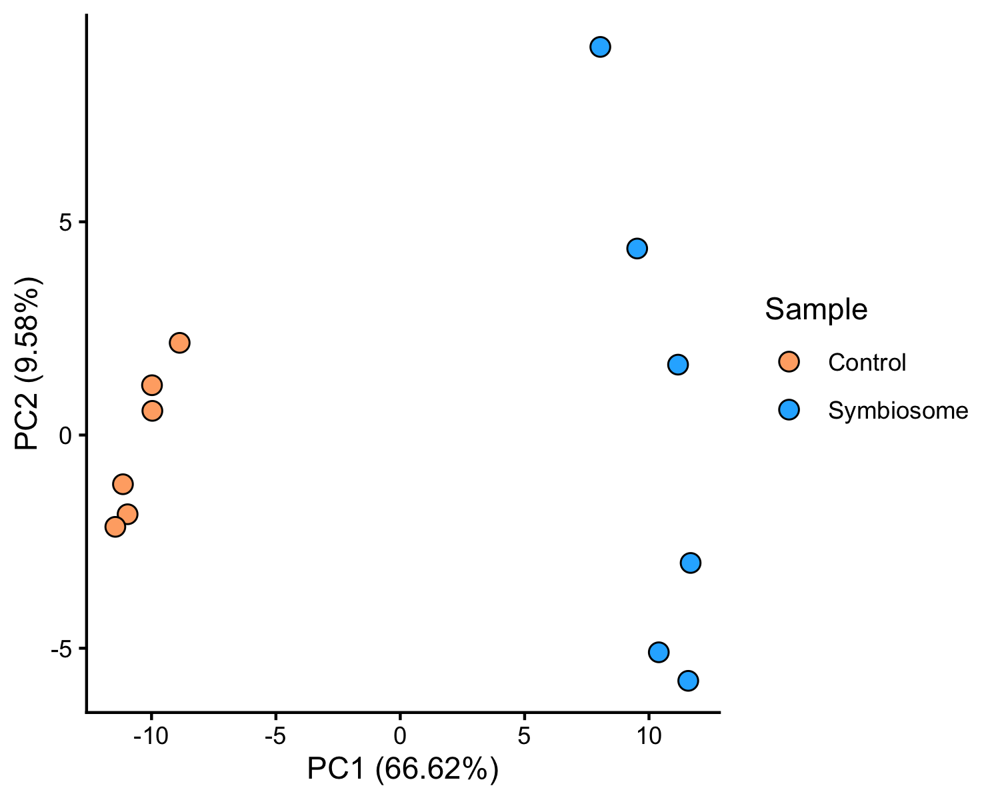<!-- -->

``` r
# Extract just Protein IDs for GO-term enrichment analysis
conenriched_AIPGENES <- countsconenriched[,"Protein.ID", drop=FALSE]
write.table(conenriched_AIPGENES, file="Aiptasia_Bmin_search_Bmin_removed_output/GO_Input/ConEnriched.txt", row.names=F, quote=F)

symenriched_AIPGENES <- countssymenriched[,"Protein.ID", drop=FALSE]
write.table(symenriched_AIPGENES, file="Aiptasia_Bmin_search_Bmin_removed_output/GO_Input/SymEnriched.txt", row.names=F, quote=F)
```

    ## [1] "Current file: ConEnriched.txt"

    ## [1] "Current file: SymEnriched.txt"

    ## [1] "Current file: ConEnriched.txt"

    ## [1] "Current file: SymEnriched.txt"

    ## [1] "Current file: ConEnriched.txt"

    ## [1] "Current file: SymEnriched.txt"

``` r
# Find top 10 most significantly enriched cell-compartment GO-terms with at least 5 significant terms
cc_Symenriched <- read.table("Aiptasia_Bmin_search_Bmin_removed_output/GO_Output/cc_SymEnriched.txt",sep="\t",header=T)
cc_Symenriched <- cc_Symenriched%>% filter((P_value<=0.05)) %>% filter(Significant>=5)
cc_Symenriched <-head(n=10,cc_Symenriched)

cc_Conenriched <- read.table("Aiptasia_Bmin_search_Bmin_removed_output/GO_Output/cc_ConEnriched.txt",sep="\t",header=T)
cc_Conenriched$P_value <- as.numeric(ifelse(cc_Conenriched$P_value=="< 1e-30", 1*10^-30, cc_Conenriched$P_value))
cc_Conenriched <- cc_Conenriched%>% filter(P_value<=0.05) %>% filter(Significant>=5)
cc_Conenriched <-head(n=10,cc_Conenriched)
```

``` r
# Make figures for cell compartment GO-terms

CCplot_symenriched<-ggplot(cc_Symenriched, aes(x= reorder(Term, -P_value), y=-log10(P_value))) + 
  geom_bar(stat = "identity", width=0.5) +   scale_y_continuous(expand = expansion(mult = c(0, 0.05)))+
  coord_flip() +
  theme_classic()+theme(axis.text.x = element_text(angle = 90, vjust = 0.5, hjust=1)) + 
  labs(y="-log10(P-value)",x="", title="Symbiosome enriched")

CCplot_conenriched<-ggplot(cc_Conenriched, aes(x= reorder(Term, -P_value), y=-log10(P_value))) + 
  geom_bar(stat = "identity", width=0.5) +   scale_y_continuous(expand = expansion(mult = c(0, 0.05)))+
  coord_flip() +
  theme_classic()+theme(axis.text.x = element_text(angle = 90, vjust = 0.5, hjust=1)) + 
  labs(y="-log10(P-value)",x="", title="Control enriched")

allCCplots<- ggarrange(CCplot_conenriched, CCplot_symenriched,nrow=1, common.legend = TRUE, legend = "right")
allCCplots
```

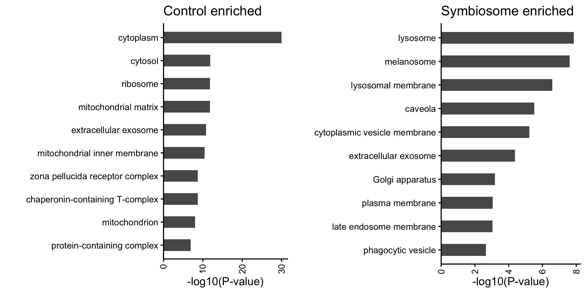<!-- -->

``` r
#Make figures for transmembrane protein analysis and RNAseq comparison
counts_vol$SAG <- ifelse(counts_vol$log2FoldChange_Sym0_Apo0>=1, "TRUE", "FALSE")
counts_vol$TM <- ifelse(counts_vol$TM_Helices>=1, "TRUE", "FALSE")

SAGsymcount <- length(which(counts_vol$Enrichment == "SymEnriched" & counts_vol$SAG=="TRUE"))
totalsymcount <- length(which(counts_vol$Enrichment=="SymEnriched"))
Percent_symSAG <- SAGsymcount/(totalsymcount)


SAGconcount <- length(which(counts_vol$Enrichment == "ConEnriched" & counts_vol$SAG=="TRUE"))
totalconcount <- length(which(counts_vol$Enrichment=="ConEnriched"))
Percent_conSAG <- SAGconcount/totalconcount

TMsymcount <- length(which(counts_vol$Enrichment == "SymEnriched" & counts_vol$TM=="TRUE"))
Percent_symTM <- TMsymcount/totalsymcount

TMconcount <- length(which(counts_vol$Enrichment == "ConEnriched" & counts_vol$TM=="TRUE"))
Percent_conTM <- TMconcount/totalconcount


SAG_TM_data <- data.frame(
  Enrichment = c("Control Enriched", "Symbiosome Enriched"),
  SAG = c(Percent_conSAG, Percent_symSAG),  # fill in your counts
  TM = c(Percent_conTM, Percent_symTM)    # fill in your counts
)


TMPercentplot <- ggplot(SAG_TM_data, aes(x=Enrichment, y=TM)) +
geom_bar(stat="identity", position=position_dodge()) +theme_classic() +
  scale_y_continuous(labels=scales::percent,limits=c(0,.31), expand = expansion(mult = c(0, 0.05))) + labs(x="") +
   geom_hline(yintercept = .193, color = "darkgray", linetype = "dashed") + ylab("Proteins with predicted \n transmembrane domains")

SAGPercentplot <- ggplot(SAG_TM_data, aes(x=Enrichment, y=SAG)) +
geom_bar(stat="identity", position=position_dodge()) +theme_classic() +
  scale_y_continuous(labels=scales::percent,limits=c(0,.22), expand = expansion(mult = c(0, 0.05))) + labs(x="")+
   geom_hline(yintercept = .045, color = "darkgray", linetype = "dashed") + ylab("Proteins that are transcriptionally \n upregulated with symbiosis")

ggarrange(TMPercentplot, SAGPercentplot)
```

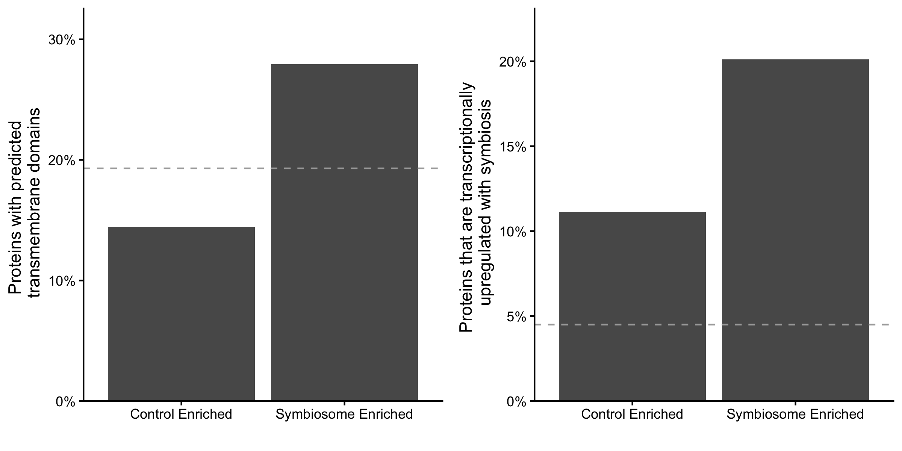<!-- -->

## Aiptasia and scrambled Breviolum minutum combined search

``` r
# Grab protein data
rawdata <- read.table("Inputs/combined_protein_Aiptasia_Bminscram.tsv", sep= "\t",  header=TRUE, quote="")

# Extract Aiptasia proteins, removing contaminants
rawdata_Aiponly <- rawdata %>% filter(str_detect(Protein.ID, "^AIP"))

# Extract only intensity values for Normalyzer
rawdata_Aiponly_intensity <- rawdata_Aiponly %>% dplyr::select("Protein.ID","Symbiosome_1.Intensity","Symbiosome_2.Intensity","Symbiosome_3.Intensity","Symbiosome_4.Intensity","Symbiosome_5.Intensity","Symbiosome_6.Intensity","Control_1.Intensity","Control_2.Intensity","Control_3.Intensity","Control_4.Intensity","Control_5.Intensity","Control_6.Intensity")

# Write table into file
write.table(rawdata_Aiponly_intensity, file="Aiptasia_Bminscram_search_output/Aiptasia_proteins.tsv", sep="\t", row.names=F, quote=F)
```

``` r
# Use Normalyzer on curated data
outDir <- "Aiptasia_Bminscram_search_output"
designFp <- "Inputs/Normalyzermatrix.tsv"
dataFp <- "Aiptasia_Bminscram_search_output/Aiptasia_proteins.tsv"
normalyzer(jobName="vignette_run_Aipnorm", designPath=designFp, dataPath=dataFp, outputDir=outDir)
```

``` r
# Perform statistical analysis using Normalyzer on Cyclic Loess normalized data
normMatrixPath <- paste(outDir, "vignette_run_Aipnorm/CycLoess-normalized.txt", sep="/")
normalyzerDE("vignette_run_Aipnorm",
  comparisons=c("Control-Symbiosome"),
  designPath=designFp,
  dataPath=normMatrixPath,
  outputDir=outDir,
  condCol="group")
```

    ## [1] "Setting up statistics object"
    ## [1] "Calculating statistical contrasts..."
    ## [1] "Contrast calculations done!"
    ## [1] "Writing 2028 annotated rows to Aiptasia_Bminscram_search_output/vignette_run_Aipnorm/vignette_run_Aipnorm_stats.tsv"
    ## [1] "Writing statistics report"

    ## [1] "All done! Results are stored in: Aiptasia_Bminscram_search_output/vignette_run_Aipnorm, processing time was 0 minutes"

``` r
# Rename spreadsheet
CycLoess_Aiponly <- read.table("Aiptasia_Bminscram_search_output/vignette_run_Aipnorm/vignette_run_Aipnorm_stats.tsv", sep="\t", header=TRUE)
CycLoess_Aiponly <- CycLoess_Aiponly %>% dplyr::rename("CycLoess_Con1"="Control_1.Intensity")
CycLoess_Aiponly <- CycLoess_Aiponly %>% dplyr::rename("CycLoess_Con2"="Control_2.Intensity")
CycLoess_Aiponly <- CycLoess_Aiponly %>% dplyr::rename("CycLoess_Con3"="Control_3.Intensity")
CycLoess_Aiponly <- CycLoess_Aiponly %>% dplyr::rename("CycLoess_Con4"="Control_4.Intensity")
CycLoess_Aiponly <- CycLoess_Aiponly %>% dplyr::rename("CycLoess_Con5"="Control_5.Intensity")
CycLoess_Aiponly <- CycLoess_Aiponly %>% dplyr::rename("CycLoess_Con6"="Control_6.Intensity")
CycLoess_Aiponly <- CycLoess_Aiponly %>% dplyr::rename("CycLoess_Sym1"="Symbiosome_1.Intensity")
CycLoess_Aiponly <- CycLoess_Aiponly %>% dplyr::rename("CycLoess_Sym2"="Symbiosome_2.Intensity")
CycLoess_Aiponly <- CycLoess_Aiponly %>% dplyr::rename("CycLoess_Sym3"="Symbiosome_3.Intensity")
CycLoess_Aiponly <- CycLoess_Aiponly %>% dplyr::rename("CycLoess_Sym4"="Symbiosome_4.Intensity")
CycLoess_Aiponly <- CycLoess_Aiponly %>% dplyr::rename("CycLoess_Sym5"="Symbiosome_5.Intensity")
CycLoess_Aiponly <- CycLoess_Aiponly %>% dplyr::rename("CycLoess_Sym6"="Symbiosome_6.Intensity")

# Merge with annotations
Annotations <- read.table("Inputs/aiptasia_genome.annot.tsv",quote="", sep="\t", header=TRUE)
Annotated_proteome <- left_join(CycLoess_Aiponly, Annotations, by=c("Protein.ID"="Query"))

# Merge with Apo/Sym RNAseq from Cleves et al. 2020 PNAS data 
RNAseq <- read_excel("Inputs/symbiosis_associated_genes.xlsx", skip = 2)
RNAseq <- RNAseq %>% dplyr::select(Aipgenes, log2FoldChange_Sym0_Apo0, padj_Sym0_Apo0)
Annotated_proteome_RNAseq <- left_join(Annotated_proteome, RNAseq, by=c("Protein.ID"="Aipgenes"))

# Add TM annotation from TMHMM2.0 prediction
TM_Aipgene <- read.table("Inputs/TMHMM_Aiptasia_genome_output.tsv", sep='\t')
Annotated_proteome_RNAseq_TM <- left_join(Annotated_proteome_RNAseq, TM_Aipgene[,c("V1","V5")], by=c("Protein.ID"="V1"))
Annotated_proteome_RNAseq_TM <- Annotated_proteome_RNAseq_TM %>% dplyr::rename("TM_Helices"="V5")
Annotated_proteome_RNAseq_TM$TM_Helices <- str_extract(Annotated_proteome_RNAseq_TM$TM_Helices, '\\d+')
```

``` r
# Find significantly enriched proteins
counts <- Annotated_proteome_RNAseq_TM

#  Create new categorical column 
counts <- counts %>%
  mutate(Enrichment = case_when(Control.Symbiosome_log2FoldChange >= 1 & Control.Symbiosome_AdjPVal <= 0.05 ~ "ConEnriched",
                               Control.Symbiosome_log2FoldChange <= -1 & Control.Symbiosome_AdjPVal <= 0.05 ~ "SymEnriched",
                               TRUE ~ "NS"))

# Pull out Symbiosome-enriched proteins
countssymenriched=counts %>%
  filter(Enrichment=="SymEnriched") %>% arrange(Control.Symbiosome_log2FoldChange)

# Remove symbiosome-enriched proteins found in less than 3 samples.
countssymenriched <- countssymenriched %>%
 filter((!is.na(CycLoess_Sym1)) + (!is.na(CycLoess_Sym2)) + (!is.na(CycLoess_Sym3)) + (!is.na(CycLoess_Sym4)) + (!is.na(CycLoess_Sym5)) + (!is.na(CycLoess_Sym6)) >= 3)

# Find Unique genes in Sym -This is only unique proteins that are found in at least 3 sym samples and not in any of the controls.
CountsnotinCon <- counts %>%
  filter((is.na(CycLoess_Con1)) + (is.na(CycLoess_Con2)) + (is.na(CycLoess_Con3)) + (is.na(CycLoess_Con4)) + (is.na(CycLoess_Con5)) + (is.na(CycLoess_Con6)) == 6)
CountsnotinCon_Sym <- CountsnotinCon %>%
  filter((!is.na(CycLoess_Sym1)) + (!is.na(CycLoess_Sym2)) + (!is.na(CycLoess_Sym3)) + (!is.na(CycLoess_Sym4)) + (!is.na(CycLoess_Sym5)) + (!is.na(CycLoess_Sym6)) >= 3)

# Combined dataframes countssymenriched with the unique genes
countssymenriched <- rbind(countssymenriched,CountsnotinCon_Sym)
countssymenriched$Enrichment <- "SymEnriched"
# Write csv file
write.csv(countssymenriched,file="Aiptasia_Bminscram_search_output/Symbiosome_enriched_proteins.csv", row.names=F)

# Pull out Control-enriched proteins
countsconenriched <- counts %>%
  filter(Enrichment=="ConEnriched") %>% arrange(Control.Symbiosome_log2FoldChange)

# Remove control-enriched proteins found in less than 3 samples.
countsconenriched <- countsconenriched %>%
  filter((!is.na(CycLoess_Con1)) + (!is.na(CycLoess_Con2)) + (!is.na(CycLoess_Con3)) + (!is.na(CycLoess_Con4)) + (!is.na(CycLoess_Con5)) + (!is.na(CycLoess_Con6)) >= 3)

# Find Unique proteins in con -This is only unique proteins that are found in at least 3 con samples and not in any of the symbiosome.
CountsinCon <- counts %>%
  filter((!is.na(CycLoess_Con1)) + (!is.na(CycLoess_Con2)) + (!is.na(CycLoess_Con3)) + (!is.na(CycLoess_Con4)) + (!is.na(CycLoess_Con5)) + (!is.na(CycLoess_Con6)) >= 3)
CountsinCon_notinSym=CountsinCon %>%
  filter((is.na(CycLoess_Sym1)) + (is.na(CycLoess_Sym2)) + (is.na(CycLoess_Sym3)) + (is.na(CycLoess_Sym4)) + (is.na(CycLoess_Sym5)) + (is.na(CycLoess_Sym6)) == 6)

# Combined dataframes countsconenriched with the unique genes
countsconenriched <- rbind(countsconenriched,CountsinCon_notinSym)
countsconenriched$Enrichment <- "ConEnriched"

# Write csv
write.csv(countsconenriched,file="Aiptasia_Bminscram_search_output/Control_enriched_proteins.csv", row.names=F)
```

``` r
# Create volcano plots
cols <- c("ConEnriched" = "#ffad73", "SymEnriched" = "#26b3ff", "NS" = "grey") 
sizes <- c("ConEnriched" = 2, "SymEnriched" = 2, "NS" = 1) 
alphas <- c("ConEnriched" = 1, "SymEnriched" = 1, "NS" = 0.5)
counts_noNSig <- counts %>% filter(Enrichment == "NS")
counts_vol <- rbind(countssymenriched, countsconenriched, counts_noNSig)

Known_genes <- read.csv("Inputs/Known_symbiosome_genes.csv",header=T)

counts_vol_known<-left_join(counts_vol,Known_genes,by=c("Protein.ID"="AIPGENE"))


vol_plot_known <- counts_vol_known %>%
  ggplot(aes(x = -Control.Symbiosome_log2FoldChange,
             y = -log10(Control.Symbiosome_AdjPVal),
             fill = Enrichment,    
             size = Enrichment,
             alpha = Enrichment,
             label = GENE)) +
  theme_classic() +
   geom_point(shape=21, show.legend=F) +
    scale_fill_manual(values = cols, name="Expression") + #  Modify point colour
    scale_size_manual(values = sizes, name="Expression") + #  Modify point size
    scale_alpha_manual(values = alphas, name="Expression") +
  labs(x="Symbiosome:Control Log2FC", y="-log10 Adj P value")+
  geom_hline(yintercept = -log10(0.05), linetype = "dashed") +
  geom_vline(xintercept = c(-1, 1), linetype = "dashed") +
  xlim(-10,10) + geom_label_repel(show.legend=F,size=2,alpha=1,max.overlaps = Inf, aes(),
    position = position_nudge_repel(x=2,y = 1),box.padding=0.3)
vol_plot_known
```

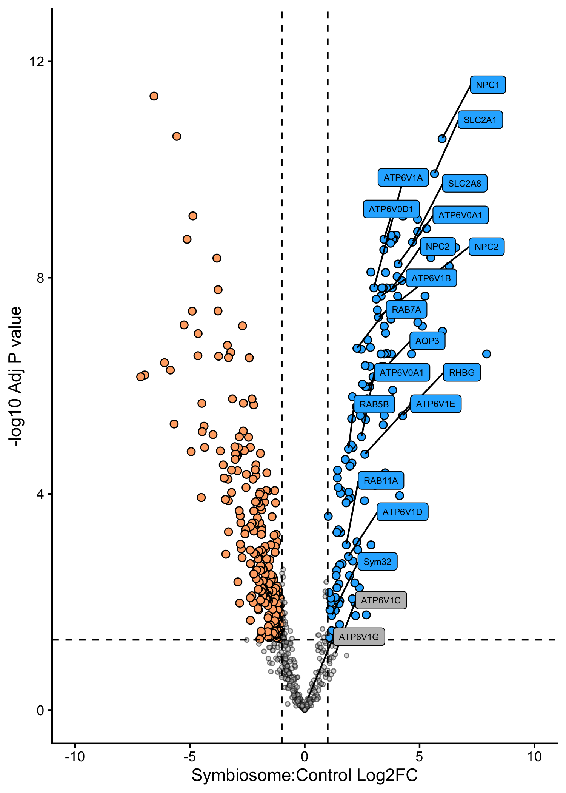<!-- -->

``` r
# PCA plots
PCAdata <- counts %>% dplyr::select("Protein.ID","CycLoess_Con1", "CycLoess_Con2", "CycLoess_Con3","CycLoess_Con4","CycLoess_Con5","CycLoess_Con6", "CycLoess_Sym1","CycLoess_Sym2","CycLoess_Sym3","CycLoess_Sym4","CycLoess_Sym5","CycLoess_Sym6")
PCAdata <- PCAdata %>% tidyr::drop_na()
PCAdata <- setNames(data.frame(t(PCAdata[,-1])), PCAdata[,1])
PCAdata <- PCAdata %>% 
  rownames_to_column(var = "ID")
PCAdata$Replicate <- c("1","2","3","1","2","3")
PCAdata$Treatment <- c("Control","Control","Control","Control","Control","Control","Symbiosome","Symbiosome", "Symbiosome","Symbiosome","Symbiosome", "Symbiosome")
PCAdata <- PCAdata %>% relocate("Replicate", .after="ID")
PCAdata <- PCAdata %>% relocate("Treatment", .before="Replicate")
PCAdata <- PCAdata%>% dplyr::select(-c("ID","Replicate"))
pca_res <- prcomp(PCAdata[,-1], scale. = TRUE)
PCi <-data.frame(pca_res$x,Treatment=PCAdata$Treatment)

pca_var <- pca_res$sdev^2
pca_var_pct <- round(pca_var / sum(pca_var) * 100, 2)

PC1_label <- paste0("PC1 (", pca_var_pct[1], "%)")
PC2_label <- paste0("PC2 (", pca_var_pct[2], "%)")

ggplot(PCi,aes(x=PC1,y=PC2,fill=Treatment))+
   geom_point(size=3, shape=21)+ # Size and alpha just for fun
   scale_fill_manual(values = c("#ffad73","#26b3ff"))+ # your colors here
  xlab(PC1_label) + ylab(PC2_label)+
  labs(fill = "Sample") +
  theme_classic() 
```

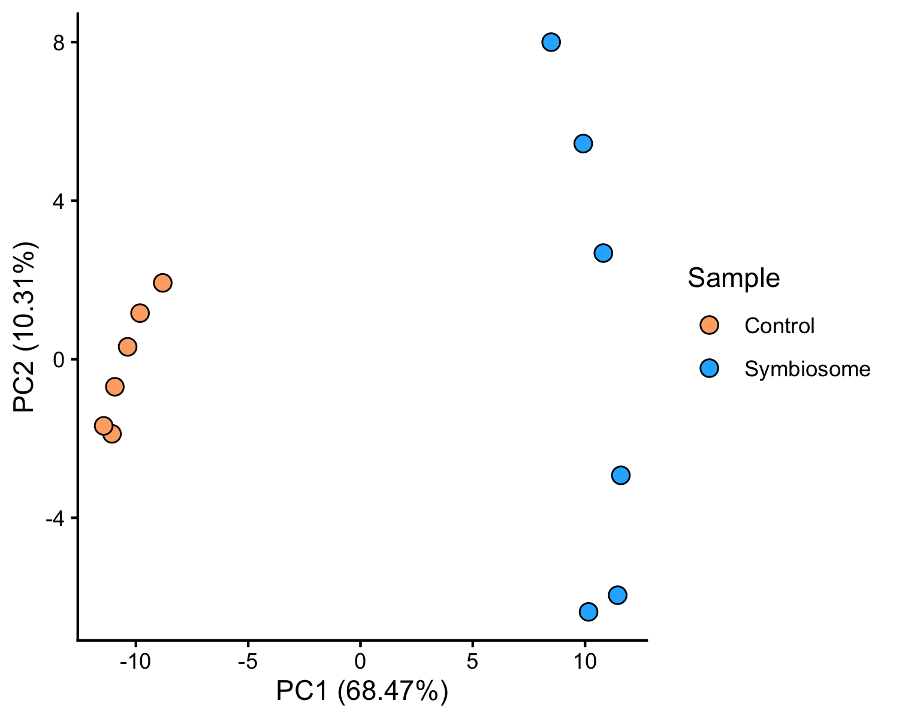<!-- -->

``` r
# Extract just Protein IDs for GO-term enrichment analysis
conenriched_AIPGENES <- countsconenriched[,"Protein.ID", drop=FALSE]
write.table(conenriched_AIPGENES, file="Aiptasia_Bminscram_search_output/GO_Input/ConEnriched.txt", row.names=F, quote=F)

symenriched_AIPGENES <- countssymenriched[,"Protein.ID", drop=FALSE]
write.table(symenriched_AIPGENES, file="Aiptasia_Bminscram_search_output/GO_Input/SymEnriched.txt", row.names=F, quote=F)
```

    ## [1] "Current file: ConEnriched.txt"

    ## [1] "Current file: SymEnriched.txt"

    ## [1] "Current file: ConEnriched.txt"

    ## [1] "Current file: SymEnriched.txt"

    ## [1] "Current file: ConEnriched.txt"

    ## [1] "Current file: SymEnriched.txt"

``` r
# Find top 10 most significantly enriched cell-compartment GO-terms with at least 5 significant terms.
cc_Symenriched <- read.table("Aiptasia_Bminscram_search_output/GO_Output/cc_SymEnriched.txt",sep="\t",header=T)
cc_Symenriched <- cc_Symenriched%>% filter((P_value<=0.05)) %>% filter(Significant>=5)
cc_Symenriched <-head(n=10,cc_Symenriched)

cc_Conenriched <- read.table("Aiptasia_Bminscram_search_output/GO_Output/cc_ConEnriched.txt",sep="\t",header=T)
cc_Conenriched$P_value <- as.numeric(ifelse(cc_Conenriched$P_value=="< 1e-30", 1*10^-30, cc_Conenriched$P_value))
cc_Conenriched <- cc_Conenriched%>% filter(P_value<=0.05) %>% filter(Significant>=5)
cc_Conenriched <-head(n=10,cc_Conenriched)

# Make figures for cell compartment GO-terms

CCplot_symenriched<-ggplot(cc_Symenriched, aes(x= reorder(Term, -P_value), y=-log10(P_value))) + 
  geom_bar(stat = "identity", width=0.5) +   scale_y_continuous(expand = expansion(mult = c(0, 0.05)))+
  coord_flip() +
  theme_classic()+theme(axis.text.x = element_text(angle = 90, vjust = 0.5, hjust=1)) + 
  labs(y="-log10(P-value)",x="", title="Symbiosome enriched")

CCplot_conenriched<-ggplot(cc_Conenriched, aes(x= reorder(Term, -P_value), y=-log10(P_value))) + 
  geom_bar(stat = "identity", width=0.5) +   scale_y_continuous(expand = expansion(mult = c(0, 0.05)))+
  coord_flip() +
  theme_classic()+theme(axis.text.x = element_text(angle = 90, vjust = 0.5, hjust=1)) + 
  labs(y="-log10(P-value)",x="", title="Control enriched")

allCCplots<- ggarrange(CCplot_conenriched, CCplot_symenriched,nrow=1, common.legend = TRUE, legend = "right")
allCCplots
```

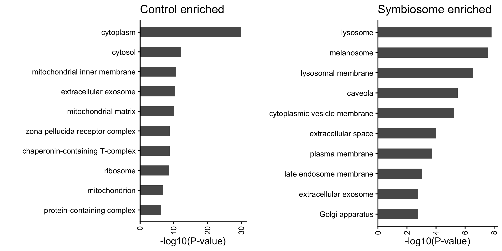<!-- -->

``` r
# Make figures for transmembrane protein analysis and RNAseq comparison
counts_vol$SAG <- ifelse(counts_vol$log2FoldChange_Sym0_Apo0>=1, "TRUE", "FALSE")
counts_vol$TM <- ifelse(counts_vol$TM_Helices>=1, "TRUE", "FALSE")

SAGsymcount <- length(which(counts_vol$Enrichment == "SymEnriched" & counts_vol$SAG=="TRUE"))
totalsymcount <- length(which(counts_vol$Enrichment=="SymEnriched"))
Percent_symSAG <- SAGsymcount/(totalsymcount)


SAGconcount <- length(which(counts_vol$Enrichment == "ConEnriched" & counts_vol$SAG=="TRUE"))
totalconcount <- length(which(counts_vol$Enrichment=="ConEnriched"))
Percent_conSAG <- SAGconcount/totalconcount

TMsymcount <- length(which(counts_vol$Enrichment == "SymEnriched" & counts_vol$TM=="TRUE"))
Percent_symTM <- TMsymcount/totalsymcount

TMconcount <- length(which(counts_vol$Enrichment == "ConEnriched" & counts_vol$TM=="TRUE"))
Percent_conTM <- TMconcount/totalconcount


SAG_TM_data <- data.frame(
  Enrichment = c("Control Enriched", "Symbiosome Enriched"),
  SAG = c(Percent_conSAG, Percent_symSAG),  #  fill in your counts
  TM = c(Percent_conTM, Percent_symTM)    #  fill in your counts
)


TMPercentplot <- ggplot(SAG_TM_data, aes(x=Enrichment, y=TM)) +
geom_bar(stat="identity", position=position_dodge()) +theme_classic() +
  scale_y_continuous(labels=scales::percent,limits=c(0,.3), expand = expansion(mult = c(0, 0.05))) + labs(x="") +
   geom_hline(yintercept = .193, color = "darkgray", linetype = "dashed") + ylab("Proteins with predicted \n transmembrane domains")

SAGPercentplot <- ggplot(SAG_TM_data, aes(x=Enrichment, y=SAG)) +
geom_bar(stat="identity", position=position_dodge()) +theme_classic() +
  scale_y_continuous(labels=scales::percent,limits=c(0,.21), expand = expansion(mult = c(0, 0.05))) + labs(x="")+
   geom_hline(yintercept = .045, color = "darkgray", linetype = "dashed") + ylab("Proteins that are transcriptionally \n upregulated with symbiosis")

ggarrange(TMPercentplot, SAGPercentplot)
```

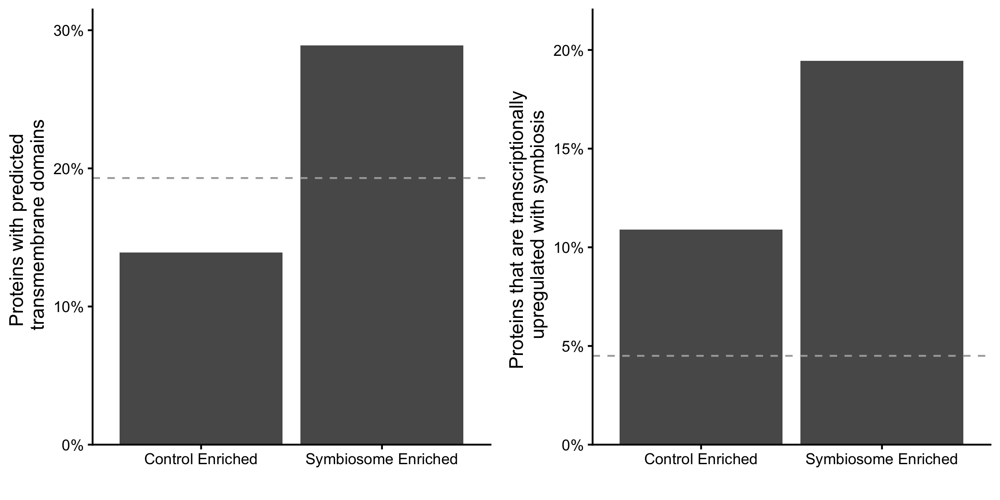<!-- -->

## Symbiosome-enriched protein comparisons

``` r
library(tidyverse)
Aip_search <- read.csv("Aiptasia_only_search_output/Symbiosome_enriched_proteins.csv", header=TRUE)
Combined_search <- read.csv("Aiptasia_Bmin_search_output/Symbiosome_enriched_proteins.csv", header=TRUE)
Bminremoved_Aip_search <- read.csv("Aiptasia_only_search_Bmin_removed_output/Symbiosome_enriched_proteins.csv", header=TRUE)
Bminremoved_combined_search <- read.csv("Aiptasia_Bmin_search_Bmin_removed_output/Symbiosome_enriched_proteins.csv", header=TRUE)
BminScram_search <- read.csv("Aiptasia_Bminscram_search_output/Symbiosome_enriched_proteins.csv", header=TRUE)

tag_list <- function(df, list_name) {
  df %>%
    dplyr::select(Protein.ID, Hit.description) %>%
    distinct() %>%
    mutate(!!list_name := TRUE)          # adds a TRUE column named after the list
}

aip_tagged              <- tag_list(Aip_search,                  "Aip_search")
combined_tagged         <- tag_list(Combined_search,             "Combined_search")
bminremoved_tagged      <- tag_list(Bminremoved_Aip_search,      "Bminremoved_Aip_search")
bminremoved_comb_tagged <- tag_list(Bminremoved_combined_search, "Bminremoved_combined_search")
bminscram_tagged        <- tag_list(BminScram_search,            "BminScram_search")

combined_all <- aip_tagged %>%
  full_join(combined_tagged,         by = "Protein.ID", suffix = c("", ".combined")) %>%
  full_join(bminremoved_tagged,      by = "Protein.ID", suffix = c("", ".bmin")) %>%
  full_join(bminremoved_comb_tagged, by = "Protein.ID", suffix = c("", ".bmincomb")) %>%
  full_join(bminscram_tagged,        by = "Protein.ID", suffix = c("", ".scram")) %>%
  # Coalesce Hit.description across all five sources into one column
  mutate(
    Hit.description = coalesce(
      Hit.description,
      Hit.description.combined,
      Hit.description.bmin,
      Hit.description.bmincomb,
      Hit.description.scram
    )
  ) %>%
  dplyr::select(-Hit.description.combined, -Hit.description.bmin,
         -Hit.description.bmincomb, -Hit.description.scram) %>%
  # Replace NA with FALSE (protein absent in that list)
  mutate(across(c(Aip_search, Combined_search, Bminremoved_Aip_search,
                  Bminremoved_combined_search, BminScram_search),
                ~ replace_na(.x, FALSE)))


list_names <- c("Aip_search", "Combined_search", "Bminremoved_Aip_search",
                "Bminremoved_combined_search", "BminScram_search")

combined_all <- combined_all %>%
  mutate(
    Present_in = pmap_chr(
      dplyr::select(., all_of(list_names)),
      function(...) {
        flags <- c(...)
        paste(list_names[flags], collapse = " | ")
      }
    )
  )


combined_all <- combined_all %>%
  arrange(desc(Aip_search), desc(Combined_search), desc(Bminremoved_Aip_search),
          desc(Bminremoved_combined_search), desc(BminScram_search))

combined_all %>%
  count(Present_in, sort = TRUE) %>%
  print()
```

    ##                                                                                                Present_in
    ## 1  Aip_search | Combined_search | Bminremoved_Aip_search | Bminremoved_combined_search | BminScram_search
    ## 2                                                                     Aip_search | Bminremoved_Aip_search
    ## 3                     Aip_search | Combined_search | Bminremoved_Aip_search | Bminremoved_combined_search
    ## 4                                                  Aip_search | Bminremoved_Aip_search | BminScram_search
    ## 5                                                                                        BminScram_search
    ## 6                                                           Combined_search | Bminremoved_combined_search
    ## 7                                                         Aip_search | Combined_search | BminScram_search
    ## 8                                                   Aip_search | Combined_search | Bminremoved_Aip_search
    ## 9                           Aip_search | Combined_search | Bminremoved_combined_search | BminScram_search
    ## 10                                                                                        Combined_search
    ## 11                                                                     Combined_search | BminScram_search
    ##      n
    ## 1  161
    ## 2   16
    ## 3   11
    ## 4    9
    ## 5    7
    ## 6    6
    ## 7    1
    ## 8    1
    ## 9    1
    ## 10   1
    ## 11   1

``` r
write_csv(combined_all, "protein_comparison_output.csv")
```

## Figure 1

``` r
# Chi-Square tests for Figure 2C
SAGchi<- read.csv("Inputs/Chi-square test for SAG.csv")
TMchi <-  read.csv("Inputs/Chi-square test for TM.csv")


SagMatrix <- as.matrix(SAGchi[,-1])
rownames(SagMatrix)<- SAGchi$X
chisq.test(SagMatrix)
```

    ## 
    ##  Pearson's Chi-squared test
    ## 
    ## data:  SagMatrix
    ## X-squared = 198.55, df = 2, p-value < 2.2e-16

``` r
pairwiseNominalIndependence(SagMatrix,
                            fisher = FALSE,
                            gtest  = FALSE,
                            chisq  = TRUE,
                            method = "fdr")
```

    ##             Comparison  p.Chisq p.adj.Chisq
    ## 1  Symbiosome : Genome 5.97e-23    8.96e-23
    ## 2 Symbiosome : Control 1.02e-03    1.02e-03
    ## 3     Genome : Control 5.03e-25    1.51e-24

``` r
TMmatrix <- as.matrix(TMchi[,-1])
rownames(TMmatrix) <- TMchi$X
chisq.test(TMmatrix)
```

    ## 
    ##  Pearson's Chi-squared test
    ## 
    ## data:  TMmatrix
    ## X-squared = 132.02, df = 2, p-value < 2.2e-16

``` r
pairwiseNominalIndependence(TMmatrix,
                            fisher = FALSE,
                            gtest  = FALSE,
                            chisq  = TRUE,
                            method = "fdr")
```

    ##             Comparison  p.Chisq p.adj.Chisq
    ## 1  Symbiosome : Genome 2.05e-16    3.08e-16
    ## 2 Symbiosome : Control 1.44e-28    4.32e-28
    ## 3     Genome : Control 1.23e-14    1.23e-14

``` r
stacked_data <- read.csv(file="Inputs/symbiosome_enrichment_image_analysis.csv", header=T)
stacked_data$Prep<- factor(stacked_data$Prep, levels=c("Dissociated cells", "After host cell lysis", "After Percoll", "After NP-40"))
levels(stacked_data$Prep)[levels(stacked_data$Prep)=="After host cell lysis"] <- "After host\ncell lysis"
levels(stacked_data$Prep)[levels(stacked_data$Prep)=="Dissociated cells"] <- "Dissociated\ncells"
levels(stacked_data$Prep)[levels(stacked_data$Prep)=="After Percoll"] <- "After\nPercoll"
levels(stacked_data$Prep)[levels(stacked_data$Prep)=="After NP-40"] <- "After\nNP-40"
stacked_data$Prep<- factor(stacked_data$Prep, levels=c("Dissociated\ncells", "After host\ncell lysis", "After\nPercoll", "After\nNP-40"))

stacked_data$Staining <- factor(stacked_data$Staining, levels=c("Symbiocyte","Symbiosome","Free algae"))

stackedcolors<- c("magenta","#56B4E9","gold")

stacked_fig <- stacked_data %>% ggplot(aes(fill=Staining, y=Percentage, x=Prep)) + 
  geom_bar(position="fill", stat="identity")+
  scale_fill_manual(values=stackedcolors) +
  scale_y_continuous(labels = scales::percent,
                                      expand = c(0,0),
                                      limits = c(0,1),
                                      breaks= c(0,0.2,0.4,0.6,0.8,1))+
                     theme_classic(base_size = 15)+
                     theme(axis.title.x=element_blank()) 
stacked_fig
```

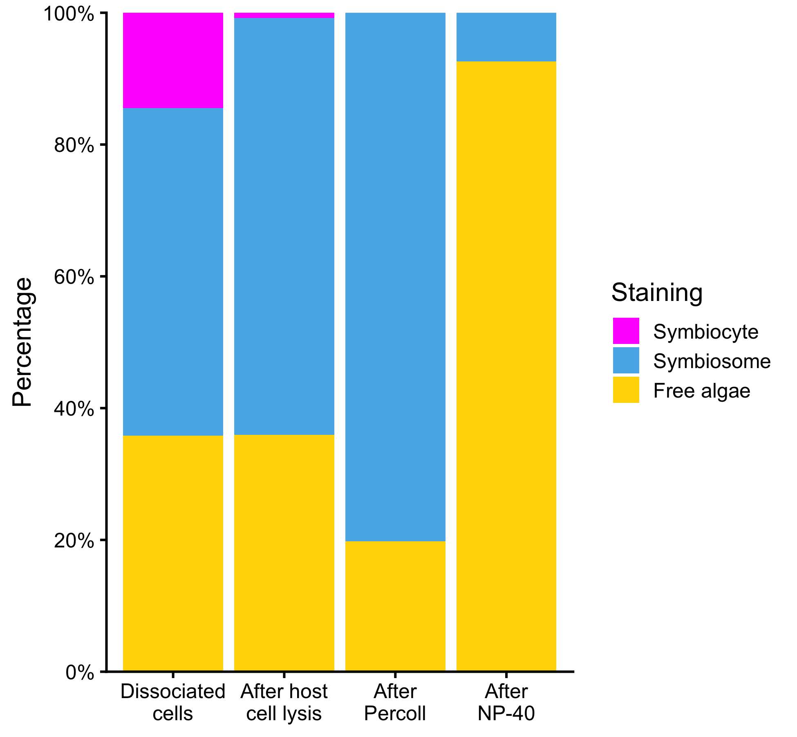<!-- -->

## Figure 3

``` r
# Figure 3 plots and statistics
Vesicles_LAMP1 <- read.csv("Inputs/Fig_3D.csv")
symbiosome.colors <- c("yes" = "#00BFC4", "no" = "orange") 


Vesicles_LAMP1_plot<- Vesicles_LAMP1%>% ggplot(aes(y=Vesicle.diameters.micron, x=Sample, col=LAMP1.positive.)) + 
  scale_color_manual(values = symbiosome.colors, name="LAMP1 positive") +
  geom_beeswarm(cex = 3, size=3, priority="random") + 
  theme_classic() +
  scale_x_discrete(limits=c("Symbiocyte","Symbiosome"))+
  xlab("Sample preparation")+
  ylab("Vesicle diameter (micron)") + scale_y_continuous(expand = c(0, 0),limit=c(0,2))


Vesicles_LAMP1_percent <- read.csv("Inputs/Fig_3E.csv")

symbiocyte.colors <- c("Symbiocyte" = "#F5A9B8", "Symbiosome" = "#26B3FF") 


Vesicles_LAMP1_percent_plot <- Vesicles_LAMP1_percent%>% ggplot(aes(y=Percent_ves, x=Sample, col=Sample)) + 
  geom_beeswarm(cex = 3, size=3, priority="random") +theme_classic() +
  scale_color_manual(values = symbiocyte.colors, guide="none") +
  xlab("Sample preparation")+scale_y_continuous(expand = c(0, 0),limit=c(0,1),labels = scales::percent)+
  ylab("Proportion of symbiosomes \nwith at least one vesicle")

# Stats for Fig 3D
t.test(data=Vesicles_LAMP1, Vesicle.diameters.micron~Sample)
```

    ## 
    ##  Welch Two Sample t-test
    ## 
    ## data:  Vesicle.diameters.micron by Sample
    ## t = -6.8053, df = 48.818, p-value = 1.352e-08
    ## alternative hypothesis: true difference in means between group Symbiocyte and group Symbiosome is not equal to 0
    ## 95 percent confidence interval:
    ##  -0.6711556 -0.3651176
    ## sample estimates:
    ## mean in group Symbiocyte mean in group Symbiosome 
    ##                0.6159434                1.1340800

``` r
# Stats for Fig 3E
t.test(data=Vesicles_LAMP1_percent, Percent_ves~Sample)
```

    ## 
    ##  Welch Two Sample t-test
    ## 
    ## data:  Percent_ves by Sample
    ## t = 21.381, df = 3.933, p-value = 3.233e-05
    ## alternative hypothesis: true difference in means between group Symbiocyte and group Symbiosome is not equal to 0
    ## 95 percent confidence interval:
    ##  0.6462839 0.8406742
    ## sample estimates:
    ## mean in group Symbiocyte mean in group Symbiosome 
    ##                0.9269006                0.1834215

``` r
ggarrange(Vesicles_LAMP1_percent_plot, Vesicles_LAMP1_plot, ncol = 1, align = "v", common.legend = TRUE)
```

<!-- -->

## Figure 4

``` r
# Plots and statistics for Fig 4
qPCRdata <- read.csv("Inputs/Fig_4E.csv")

LAMP1b_qpcr_data <- qPCRdata %>% subset(Target == "Lamp1b")

LAMP1b_qpcr_summary <- LAMP1b_qpcr_data %>%
  group_by(Gene) %>%
  summarise(
    sd = sd(fc_Ct_method, na.rm = TRUE),
    fc_Ct_method = mean(fc_Ct_method)
  )

LAMP1B_qPCR_plot <- LAMP1b_qpcr_data%>% ggplot(aes(x=Gene, y=fc_Ct_method, col=Date_EP)) +
  geom_col(data=LAMP1b_qpcr_summary, fill="grey", color="grey")+
  geom_errorbar(aes(ymin = fc_Ct_method-sd, ymax = fc_Ct_method+sd), 
                 data = LAMP1b_qpcr_summary, width = 0.2, color="black") +
  geom_beeswarm(size=3, cex=3.5) +   scale_color_discrete(guide="none") +
  theme_classic() +ylab("Fold change\nmRNA expression") +
  scale_y_continuous(expand = c(0, 0), limits = c(0, 1.25), breaks = seq(0, 1.5, by=.25)) +
  scale_x_discrete(limit=c("shScrambled","Lamp1b")) 


ATP_qPCR_data <- qPCRdata %>% subset(Target == "ATPV0D1")

ATP_summary <- ATP_qPCR_data %>%
  group_by(Gene) %>%
  summarise(
    sd = sd(fc_Ct_method, na.rm = TRUE),
    fc_Ct_method = mean(fc_Ct_method)
  )

ATP_qPCR_plot <- ATP_qPCR_data%>% ggplot(aes(x=Gene, y=fc_Ct_method, col=Date_EP)) +
  geom_col(data=ATP_summary, fill="grey", color="grey")+
  geom_errorbar(aes(ymin = fc_Ct_method-sd, ymax = fc_Ct_method+sd), 
                 data = ATP_summary, width = 0.2, color="black") +
  geom_beeswarm(size=3, cex=3.5) +  
  scale_color_discrete(guide="none") +
  theme_classic() + ylab("Fold change\nmRNA expression") +
  scale_y_continuous(expand = c(0, 0), limits = c(0, 1.25), breaks = seq(0, 1.5, by=.25)) +
  scale_x_discrete(limit=c("shScrambled","ATPV0D1"))


CTSB_qPCR_data <- qPCRdata %>% subset(Target == "CTSB")

CTSB_summary <- CTSB_qPCR_data %>%
  group_by(Gene) %>%
  summarise(
    sd = sd(fc_Ct_method, na.rm = TRUE),
    fc_Ct_method = mean(fc_Ct_method)
  )

CTSB_qPCR_plot <- CTSB_qPCR_data%>% ggplot(aes(x=Gene, y=fc_Ct_method, col=Date_EP)) +
  geom_col(data=CTSB_summary, fill="grey", color="grey")+
  geom_errorbar(aes(ymin = fc_Ct_method-sd, ymax = fc_Ct_method+sd), 
                 data = CTSB_summary, width = 0.2, color="black") +
  geom_beeswarm(size=3, cex=3.5) +  
  scale_color_discrete(guide="none") +
  theme_classic() + ylab("Fold change\nmRNA expression") +
  scale_y_continuous(expand = c(0, 0), limits = c(0, 1.25), breaks = seq(0, 1.5, by=.25)) +
  scale_x_discrete(limit=c("shScrambled","CTSB"))


Angle <- theme(axis.text.x = element_text(angle = 45, vjust = 1, hjust=1))


KD_data <- read.csv("Inputs/Fig_4F.csv")

LAMP1b_data <- KD_data %>% subset(Tag == "EP042325" |Tag == "EP092524" | Tag =="EP103024") %>% subset(Gene == "shScrambled" | Gene=="Lamp1b_92")

VATP_data <- KD_data %>% subset(Tag == "EP050725" | Tag=="EP042325" | Tag=="EP031225") %>% subset(Gene == "shScrambled" | Gene=="ATPV0D1")

CTSB_data <- KD_data %>% subset(Tag == "EP020525"| Tag == "EP073025" | Tag == "EP072325") %>% subset(Gene == "shScrambled" | Gene=="CTSB")

GUSB_data <- KD_data %>%  subset(Tag == "EP031225") %>% subset(Gene == "shScrambled" | Gene=="GUSB")

KD_colors <- c("EP012324","EP020525" = "#5BCEFA", "EP031225" = "magenta","EP092524"="black","EP103024"="gold", "EP050725"="gray") 


ATP_Inf_summary <- VATP_data %>%
  group_by(Gene) %>%
  summarise(
    sd = sd(Prop_norm, na.rm = TRUE),
    Prop_norm = mean(Prop_norm)
  )

VATP_KD_plot <-VATP_data %>% ggplot(aes(x=Gene,y=Prop_norm, col=Tag))+
  geom_col(data=ATP_Inf_summary, fill="grey", color="grey")+
  geom_errorbar(aes(ymin = Prop_norm-sd, ymax = Prop_norm+sd), 
                 data = ATP_Inf_summary, width = 0.2, color="black") +
  geom_beeswarm(cex = 3, size=3, priority="random") + 
  scale_color_discrete(guide="none") +
  theme_classic() + ylab("Proportion symbiotic\nrelative to shScram")+
  scale_y_continuous(expand = c(0, 0), limits = c(0, 1.5), breaks = seq(0, 1.5, by=.25),labels = scales::percent) +
  scale_x_discrete(limit=c("shScrambled","ATPV0D1"))
  


LAMP1b_inf_summary <- LAMP1b_data %>%
  group_by(Gene) %>%
  summarise(
    sd = sd(Prop_norm, na.rm = TRUE),
    Prop_norm = mean(Prop_norm)
  )

LAMP1b_plot <- LAMP1b_data %>% ggplot(aes(x=Gene,y=Prop_norm, col=Tag))+
  geom_col(data=LAMP1b_inf_summary, fill="grey", color="grey")+
  geom_errorbar(aes(ymin = Prop_norm-sd, ymax = Prop_norm+sd), 
                 data = LAMP1b_inf_summary, width = 0.2, color="black") +
  geom_beeswarm(cex = 3, size=3, priority="random") + 
  scale_color_discrete(guide="none") +
  theme_classic() + ylab("Proportion symbiotic\nrelative to shScram")+
  scale_y_continuous(expand = c(0, 0), limits = c(0, 1.5), breaks = seq(0, 1.5, by=.25),labels = scales::percent) +
  scale_x_discrete(limit=c("shScrambled","Lamp1b_92"))


CTSB_inf_summary <- CTSB_data %>%
  group_by(Gene) %>%
  summarise(
    sd = sd(Prop_norm, na.rm = TRUE),
    Prop_norm = mean(Prop_norm)
  )

CTSB_plot <-  CTSB_data %>% ggplot(aes(x=Gene,y=Prop_norm, col=Tag))+
  geom_col(data=CTSB_inf_summary, fill="grey", color="grey")+
  geom_errorbar(aes(ymin = Prop_norm-sd, ymax = Prop_norm+sd), 
                 data = CTSB_inf_summary, width = 0.2, color="black") +
  geom_beeswarm(cex = 3, size=3, priority="random") + 
  scale_color_discrete(guide="none") +
  theme_classic() + ylab("Proportion symbiotic\nrelative to shScram")+
  scale_y_continuous(expand = c(0, 0), limits = c(0, 1.5), breaks = seq(0, 1.5, by=.25),labels = scales::percent) +
  scale_x_discrete(limit=c("shScrambled","CTSB"))


# t-test for LAMP1B qPCR
t.test(data=LAMP1b_qpcr_data,fc_Ct_method~Gene)
```

    ## 
    ##  Welch Two Sample t-test
    ## 
    ## data:  fc_Ct_method by Gene
    ## t = -145.88, df = 2, p-value = 4.699e-05
    ## alternative hypothesis: true difference in means between group Lamp1b and group shScrambled is not equal to 0
    ## 95 percent confidence interval:
    ##  -0.9085184 -0.8564616
    ## sample estimates:
    ##      mean in group Lamp1b mean in group shScrambled 
    ##                   0.11751                   1.00000

``` r
# t-test for ATP6V0D1 qPCR
t.test(data=ATP_qPCR_data,fc_Ct_method~Gene)
```

    ## 
    ##  Welch Two Sample t-test
    ## 
    ## data:  fc_Ct_method by Gene
    ## t = -12.887, df = 2, p-value = 0.005967
    ## alternative hypothesis: true difference in means between group ATPV0D1 and group shScrambled is not equal to 0
    ## 95 percent confidence interval:
    ##  -0.8989373 -0.4489294
    ## sample estimates:
    ##     mean in group ATPV0D1 mean in group shScrambled 
    ##                 0.3260667                 1.0000000

``` r
# t-test for CTSB qPCR
t.test(data=CTSB_qPCR_data,fc_Ct_method~Gene)
```

    ## 
    ##  Welch Two Sample t-test
    ## 
    ## data:  fc_Ct_method by Gene
    ## t = -221.49, df = 2, p-value = 2.038e-05
    ## alternative hypothesis: true difference in means between group CTSB and group shScrambled is not equal to 0
    ## 95 percent confidence interval:
    ##  -0.9713497 -0.9343303
    ## sample estimates:
    ##        mean in group CTSB mean in group shScrambled 
    ##                   0.04716                   1.00000

``` r
# t-test for CTSB proportion symbiotic
t.test(data=CTSB_data,Prop_norm~Gene)
```

    ## 
    ##  Welch Two Sample t-test
    ## 
    ## data:  Prop_norm by Gene
    ## t = -0.2534, df = 11.882, p-value = 0.8043
    ## alternative hypothesis: true difference in means between group CTSB and group shScrambled is not equal to 0
    ## 95 percent confidence interval:
    ##  -0.1776477  0.1406676
    ## sample estimates:
    ##        mean in group CTSB mean in group shScrambled 
    ##                 0.9821495                 1.0006395

``` r
# t-test for ATP6V0D1 proportion symbiotic
t.test(data=VATP_data,Prop_norm~Gene)
```

    ## 
    ##  Welch Two Sample t-test
    ## 
    ## data:  Prop_norm by Gene
    ## t = -8.6227, df = 15.159, p-value = 3.122e-07
    ## alternative hypothesis: true difference in means between group ATPV0D1 and group shScrambled is not equal to 0
    ## 95 percent confidence interval:
    ##  -0.3518126 -0.2124579
    ## sample estimates:
    ##     mean in group ATPV0D1 mean in group shScrambled 
    ##                  0.718095                  1.000230

``` r
# t-test for LAMP1B proportion symbiotic
t.test(data=LAMP1b_data, Prop_norm~Gene)
```

    ## 
    ##  Welch Two Sample t-test
    ## 
    ## data:  Prop_norm by Gene
    ## t = -5.3638, df = 15.327, p-value = 7.331e-05
    ## alternative hypothesis: true difference in means between group Lamp1b_92 and group shScrambled is not equal to 0
    ## 95 percent confidence interval:
    ##  -0.3002494 -0.1297102
    ## sample estimates:
    ##   mean in group Lamp1b_92 mean in group shScrambled 
    ##                 0.7850595                 1.0000393

``` r
ggarrange(LAMP1B_qPCR_plot+Angle, ATP_qPCR_plot+Angle,CTSB_qPCR_plot+Angle,LAMP1b_plot+Angle, VATP_KD_plot+Angle,CTSB_plot+Angle, nrow=2, ncol=3, align="v")
```

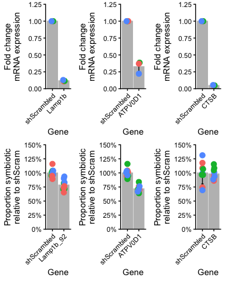<!-- -->

## Figure 5

``` r
# Plots for Fig 5D, 5F
Dark_light_tentacles_data_new <- read.csv("Inputs/Fig_5D.csv")

Dark_light_tentacles_data_new$Animal<-as.factor(Dark_light_tentacles_data_new$Animal)

Dark_light_tentacles_data_new$Guide_pair <- as.factor(Dark_light_tentacles_data_new$Guide_pair)

shapes <- c("1"=21,"2"=23)

my_colors <- c( 
  "9"  = "#999999", #  gray (Okabe-Ito)
  "10"  = "#CC79A7", #  reddish purple (Okabe-Ito)
  "11"  = "#0072B2", #  blue (Okabe-Ito)
  "12"  = "#F0E442", #  yellow (Okabe-Ito)
  "1" = "#E69F00", #  orange (Okabe-Ito) -> distinct
  "2" = "#56B4E9", #  sky blue (Okabe-Ito) -> distinct
  "3" = "#009E73", #  bluish green (Okabe-Ito) -> distinct
  "4" = "#D55E00", #  vermillion (Okabe-Ito)
  "5" = "#332288", #  dark blue (Tol extended palette)
  "6" = "#117733", #  dark green (Tol extended palette)
  "7" = "#88CCEE", #  light blue (Tol extended palette)
  "8" = "#AA4499"  #  purple-magenta (Tol extended palette)
)

Dark_light_tentacles_data_new_plot <- Dark_light_tentacles_data_new %>% ggplot(aes(x=Tentacle, y=Indel)) +
   geom_line(aes(group=Animal, color=Animal), size=1, alpha=0.5)+
  geom_point(aes(shape=Guide_pair, fill=Animal),color="black", size=3, show.legend = FALSE) +
  geom_point(aes(shape=Guide_pair),color="black", size=3) +
  scale_fill_manual(values=my_colors) +
    scale_color_manual(values=my_colors) +
  scale_shape_manual(values=shapes)+
  theme_classic() + ylab("Indel %")+xlab("Tentacle phenotype") 

Dark_light_tentacles_data_new_paired <- Dark_light_tentacles_data_new%>% select(Animal, Tentacle, Indel)
wide_df <- Dark_light_tentacles_data_new_paired %>%
  tidyr::pivot_wider(names_from = Tentacle, values_from = Indel)

#  Paired t-test for Fig 5D
t.test(wide_df$Light, wide_df$Dark, paired = TRUE)
```

    ## 
    ##  Paired t-test
    ## 
    ## data:  wide_df$Light and wide_df$Dark
    ## t = 8.3637, df = 11, p-value = 4.27e-06
    ## alternative hypothesis: true mean difference is not equal to 0
    ## 95 percent confidence interval:
    ##  43.22804 74.10529
    ## sample estimates:
    ## mean difference 
    ##        58.66667

``` r
SLC26A11_positive <- read.csv("Inputs/Fig_5F.csv")
SLC26A11_positive$Animal <-as.factor(SLC26A11_positive$Animal)

SLC26A11_positive_plot <- SLC26A11_positive %>% ggplot(aes(x=Phenotype, y=X..Positive)) +
  geom_line(aes(group=Animal, color=Animal), size=1, alpha=0.5) +
  geom_point(aes(fill=Animal),shape=21,color="black", size=3) +
  scale_color_manual(values=my_colors) +
    scale_fill_manual(values=my_colors) +
  theme_classic() + ylab("% SLC26A11 \npositive symbiosomes")+xlab("Tentacle phenotype") + ylim(0,100)

ggarrange(Dark_light_tentacles_data_new_plot,SLC26A11_positive_plot, ncol=2, common.legend=TRUE, legend="bottom")
```

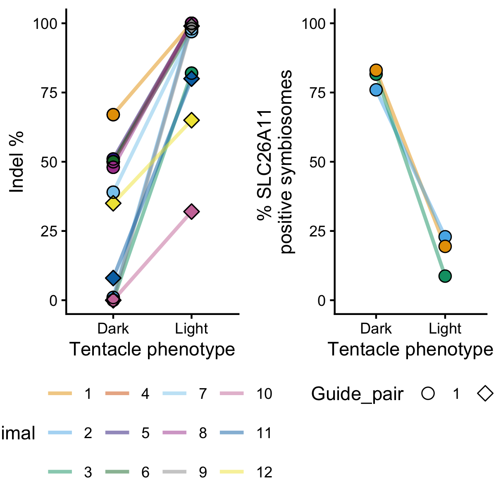<!-- -->

``` r
wide_df_symbiosome <- SLC26A11_positive %>%
  tidyr::pivot_wider(names_from = Phenotype, values_from = X..Positive)

#  Paired t-test for Fig 5F
t.test(wide_df_symbiosome$Light, wide_df_symbiosome$Dark, paired = TRUE)
```

    ## 
    ##  Paired t-test
    ## 
    ## data:  wide_df_symbiosome$Light and wide_df_symbiosome$Dark
    ## t = -11.009, df = 2, p-value = 0.00815
    ## alternative hypothesis: true mean difference is not equal to 0
    ## 95 percent confidence interval:
    ##  -87.88566 -38.49434
    ## sample estimates:
    ## mean difference 
    ##          -63.19

``` r
# Plots for CRISPR/cas9-mutagenesis of SLC26A11 in Galaxea fascicularis

mycols <- rev(c("red3","orange2", "gold2", "#3B9AB2FF"))

Scored_data <-read.csv("Inputs/Fig_5I.csv")
Scored_data$Date <- as.factor(Scored_data$Date)
Scored_data$Dish <- as.integer(Scored_data$Dish)
Scored_data$Animal <-as.factor(Scored_data$Animal)
Pair1_data <- read.csv("Inputs/Fig_5I_2.csv")
Pair1_data$Dish <- as.integer(Pair1_data$Dish)
Pair1_data$Date <- as.factor(Pair1_data$Date)
Pair1_data$Animal <- as.factor(Pair1_data$Animal)
Pair2_data <- read.csv("Inputs/Fig_5I_3.csv")
Pair2_data$Dish <- as.integer(Pair2_data$Dish)
Pair2_data$Date <- as.factor(Pair2_data$Date)
Pair2_data$Animal <- as.factor(Pair2_data$Animal)

Pair1_data_scored <- left_join(Pair1_data, Scored_data, by = c("Date" = "Date", "Dish" = "Dish", "Animal" = "Animal", "Treatment" = "Injection"))
Pair2_data_scored <- left_join(Pair2_data, Scored_data, by = c("Date" = "Date", "Dish" = "Dish", "Animal" = "Animal", "Treatment" = "Injection"))

Pair1_data_scored <- Pair1_data_scored%>%
    mutate(Score = if_else(Treatment %in% c("Cas9", "WT"), Treatment, Majority.score))
Pair2_data_scored <- Pair2_data_scored%>%
    mutate(Score = if_else(Treatment %in% c("Cas9", "WT"), Treatment, Majority.score))


Pair1_phenotype <- Pair1_data_scored %>% ggplot(aes(y=Modified1, x=Score, fill=Mean)) + 
  geom_beeswarm(cex = 2, priority="random", shape=21, size=2) + 
  theme_classic() +    
  scale_fill_gradientn(colors = mycols, limits = c(0, 22000), name = "Mean") +
  xlab("Injection")+
  ylab("Indel %") +
  scale_x_discrete(limit=c("WT","Cas9", "High","Low")) +
  stat_summary(aes(group = Simplified_score),fun = "median", geom = "crossbar", width = 0.6, size = 0.3, color = "black")

Pair2_phenotype <- Pair2_data_scored %>% ggplot(aes(y=Modified2, x=Score, fill=Mean)) + 
  geom_beeswarm(cex = 2, priority="random", shape=21, size=2) + 
  theme_classic() +    
  scale_fill_gradientn(colors = mycols, limits = c(0, 22000), name = "Mean") +
  xlab("Injection")+
  ylab("Indel %") +
  scale_x_discrete(limit=c("WT","Cas9", "High","Low")) +
  stat_summary(aes(group = Simplified_score),fun = "median", geom = "crossbar", width = 0.6, size = 0.3, color = "black")

# Stats for Guide pair 1
conover.test(Pair1_data_scored$Modified1, Pair1_data_scored$Score, method = 'bonferroni')

Pair2_data_scored_stats <- Pair2_data_scored%>%filter(Score == "WT" |Score == "Cas9"|Score == "Low")

# Stats for Guide pair 2
conover.test(Pair2_data_scored_stats$Modified2, Pair2_data_scored_stats$Score, method = 'bonferroni')


ggarrange(Pair1_phenotype, Pair2_phenotype, common.legend = TRUE, legend="right", labels= c("Guide Pair 1","Guide Pair 2"),label.y = 1.05,vjust = 1.5) %>% annotate_figure(top = text_grob(""))
```

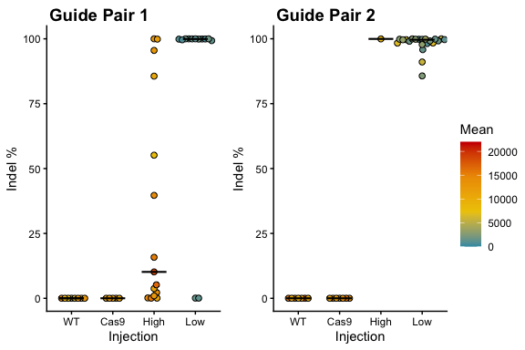<!-- -->

## Figure S9

``` r
# Figure S9
Vesicles_all <- read.csv("Inputs/Fig_S9.csv")
symbiosome.colors <- c("yes" = "#00BFC4", "no" = "orange") 


SLC26A11_Vesicles_plot<- Vesicles_all%>% ggplot(aes(y=Vesicle.diameters.micron, x=Marker, col=Positive)) + 
  scale_color_manual(values = symbiosome.colors, name="Marker positive") +
  geom_beeswarm(cex = 2.5, size=3, priority="random") + 
  theme_classic() +
  scale_x_discrete(limits=c("SLC26A11","SLC26A11_Symbiosome"), labels=c("SLC26A11"="Symbiocyte", "SLC26A11_Symbiosome"="Symbiosome"))+
  xlab("Sample")+
  ylab("Vesicle diameter (micron)") + scale_y_continuous(expand = c(0, 0),limit=c(0,2.5))

CTSB_Vesicles_plot<- Vesicles_all%>% ggplot(aes(y=Vesicle.diameters.micron, x=Marker, col=Positive)) + 
  scale_color_manual(values = symbiosome.colors, name="Marker positive") +
  geom_beeswarm(cex = 2.5, size=3, priority="random") + 
  theme_classic() +
  scale_x_discrete(limits=c("CTSB","CTSB_Symbiosome"), labels=c("CTSB"="Symbiocyte", "CTSB_Symbiosome"="Symbiosome"))+
  xlab("Sample")+
  ylab("Vesicle diameter (micron)") + scale_y_continuous(expand = c(0, 0),limit=c(0,2.5))

LAMP1B_Vesicles_plot<- Vesicles_all%>% ggplot(aes(y=Vesicle.diameters.micron, x=Marker, col=Positive)) + 
  scale_color_manual(values = symbiosome.colors, name="Marker positive") +
  geom_beeswarm(cex = 2.5, size=3, priority="random") + 
  theme_classic() +
  scale_x_discrete(limits=c("LAMP1B","LAMP1B_Symbiosome"),labels=c("LAMP1B"="Symbiocyte", "LAMP1B_Symbiosome"="Symbiosome"))+
  xlab("Sample")+
  ylab("Vesicle diameter (micron)") + scale_y_continuous(expand = c(0, 0),limit=c(0,2.5))

ggarrange(LAMP1B_Vesicles_plot, CTSB_Vesicles_plot, SLC26A11_Vesicles_plot, labels=c("LAMP1B","CTSB","SLC26A11"),label.y = 1.1,vjust = 1.5, nrow=3, hjust = 0) %>%
  annotate_figure(top = text_grob(""))
```

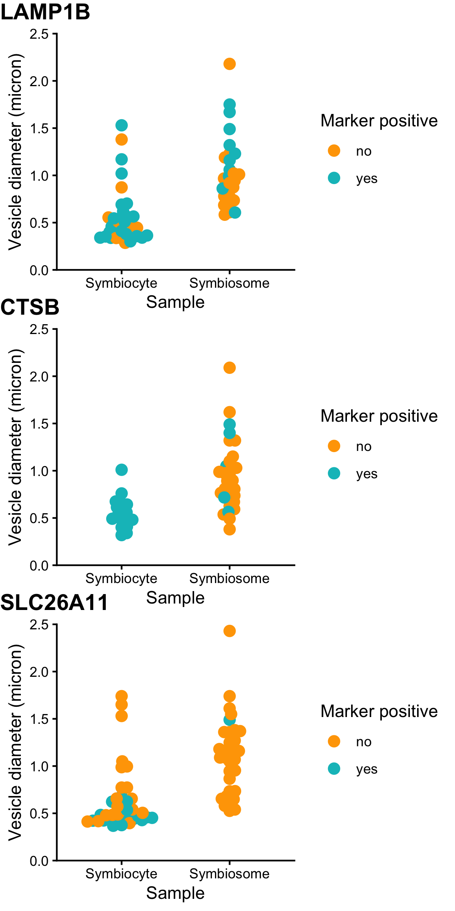<!-- -->

``` r
Vesicles_LAMP1B <- Vesicles_all%>%subset(Marker == "LAMP1B"| Marker=="LAMP1B_Symbiosome")
#Stats for LAMP1B
t.test(data=Vesicles_LAMP1B, Vesicle.diameters.micron~Marker)
```

    ## 
    ##  Welch Two Sample t-test
    ## 
    ## data:  Vesicle.diameters.micron by Marker
    ## t = -5.4265, df = 48.988, p-value = 1.767e-06
    ## alternative hypothesis: true difference in means between group LAMP1B and group LAMP1B_Symbiosome is not equal to 0
    ## 95 percent confidence interval:
    ##  -0.6681301 -0.3070093
    ## sample estimates:
    ##            mean in group LAMP1B mean in group LAMP1B_Symbiosome 
    ##                       0.5569118                       1.0444815

``` r
Vesicles_CTSB <- Vesicles_all%>%subset(Marker == "CTSB"| Marker=="CTSB_Symbiosome")

#Stats for CTSB
t.test(data=Vesicles_CTSB, Vesicle.diameters.micron~Marker)
```

    ## 
    ##  Welch Two Sample t-test
    ## 
    ## data:  Vesicle.diameters.micron by Marker
    ## t = -4.9684, df = 43.413, p-value = 1.1e-05
    ## alternative hypothesis: true difference in means between group CTSB and group CTSB_Symbiosome is not equal to 0
    ## 95 percent confidence interval:
    ##  -0.5543561 -0.2343184
    ## sample estimates:
    ##            mean in group CTSB mean in group CTSB_Symbiosome 
    ##                     0.5545294                     0.9488667

``` r
Vesicles_SLC26A11 <- Vesicles_all%>%subset(Marker == "SLC26A11"| Marker=="SLC26A11_Symbiosome")

#Stats for SLC26A11
t.test(data=Vesicles_SLC26A11, Vesicle.diameters.micron~Marker)
```

    ## 
    ##  Welch Two Sample t-test
    ## 
    ## data:  Vesicle.diameters.micron by Marker
    ## t = -5.1836, df = 59.997, p-value = 2.692e-06
    ## alternative hypothesis: true difference in means between group SLC26A11 and group SLC26A11_Symbiosome is not equal to 0
    ## 95 percent confidence interval:
    ##  -0.6526282 -0.2891875
    ## sample estimates:
    ##            mean in group SLC26A11 mean in group SLC26A11_Symbiosome 
    ##                         0.6354359                         1.1063437

## Figure S10

``` r
# Figure S10
Larvae_genotyping <- read.csv("Inputs/Fig_S10.csv")
Larvae_genotyping$Guide<-as.factor(Larvae_genotyping$Guide)

ICE_larvae_plot<- Larvae_genotyping %>% ggplot(aes(x=Guide, y=Indel, color=Guide)) + 
    geom_beeswarm(cex = 3, size=3, priority="random") + 
  theme_classic() + ylab("Indel %") +
  ylim(0,100) +
  xlab("SLC26A11 Guide pair")+
  scale_x_discrete(limit=c("1","2"))
ICE_larvae_plot
```

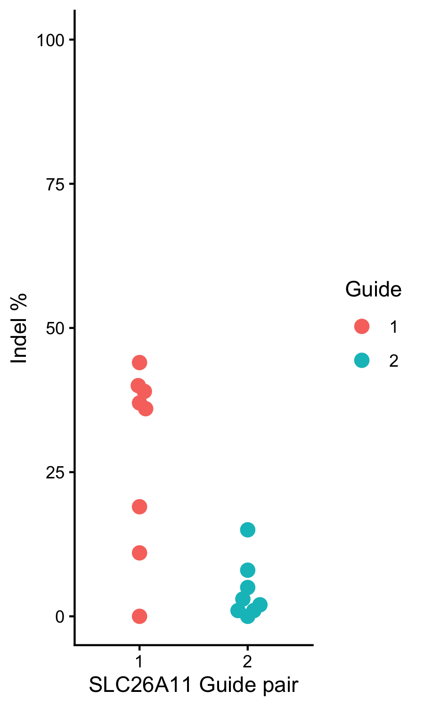<!-- -->

## Figure S12

``` r
# Figure S12
SLC26A11tentacledata <- read.csv("Inputs/Fig_S12.csv")
SLC26A11tentacledata$Anemone <-as.factor(SLC26A11tentacledata$Anemone)

SLC26A11tentacledata_justmeans_chl <- SLC26A11tentacledata %>%
  group_by(Phenotype, Anemone) %>%
  dplyr::summarize(
    Avg = mean(Mean))

SLC26A11tentacledata_justmeans_chlplot  <- SLC26A11tentacledata_justmeans_chl %>% ggplot(aes(x=Phenotype, y=Avg, color=Anemone)) +
   geom_beeswarm(cex = 3, size=3, priority="random", method="center") + 
  theme_classic() + ylab("Chlorophyll fluorescence intensity") +
  scale_x_discrete(limit=c("Dark","Light")) +
  ylim(0,25000)


SLC26A11tentacledata_justmeans_area <- SLC26A11tentacledata %>%
  group_by(Phenotype, Anemone) %>%
  dplyr::summarize(
    Avg = mean(Area))

SLC26A11tentacledata_justmeans_areaplot<- SLC26A11tentacledata_justmeans_area %>% ggplot(aes(x=Phenotype, y=Avg, color=Anemone)) +
   geom_beeswarm(cex = 3, size=3, priority="random", method="center") + 
  theme_classic() + ylab("Area (um^2)") + ylim(0,100)+
  scale_x_discrete(limit=c("Dark","Light"))

# Stats for cell size effect
darkslc_area <- SLC26A11tentacledata_justmeans_area%>%subset(Phenotype=="Dark")
lightslc_area<- SLC26A11tentacledata_justmeans_area%>%subset(Phenotype=="Light")
t.test(darkslc_area$Avg,lightslc_area$Avg, paired=TRUE)
```

    ## 
    ##  Paired t-test
    ## 
    ## data:  darkslc_area$Avg and lightslc_area$Avg
    ## t = -11.613, df = 7, p-value = 7.921e-06
    ## alternative hypothesis: true mean difference is not equal to 0
    ## 95 percent confidence interval:
    ##  -23.10064 -15.28466
    ## sample estimates:
    ## mean difference 
    ##       -19.19265

``` r
# Stats for algal chlorophyll
darkslc_chl <- SLC26A11tentacledata_justmeans_chl%>%subset(Phenotype=="Dark")
lightslc_chl <- SLC26A11tentacledata_justmeans_chl%>%subset(Phenotype=="Light")
t.test(darkslc_chl$Avg,lightslc_chl$Avg, paired=TRUE)
```

    ## 
    ##  Paired t-test
    ## 
    ## data:  darkslc_chl$Avg and lightslc_chl$Avg
    ## t = 7.0843, df = 7, p-value = 0.0001964
    ## alternative hypothesis: true mean difference is not equal to 0
    ## 95 percent confidence interval:
    ##   6771.637 13557.030
    ## sample estimates:
    ## mean difference 
    ##        10164.33

``` r
SLC26A11tentacledata_justmeans_chl
```

    ## # A tibble: 16 × 3
    ## # Groups:   Phenotype [2]
    ##    Phenotype Anemone    Avg
    ##    <chr>     <fct>    <dbl>
    ##  1 Dark      10      16489.
    ##  2 Dark      11      19433.
    ##  3 Dark      12      17775.
    ##  4 Dark      13      14989.
    ##  5 Dark      14      25286.
    ##  6 Dark      15      20120.
    ##  7 Dark      16      14292.
    ##  8 Dark      17      15960.
    ##  9 Light     10       9489.
    ## 10 Light     11       7833.
    ## 11 Light     12       6510.
    ## 12 Light     13       6165.
    ## 13 Light     14       6195.
    ## 14 Light     15      10877.
    ## 15 Light     16       6301.
    ## 16 Light     17       9659.

``` r
ggarrange(SLC26A11tentacledata_justmeans_chlplot, SLC26A11tentacledata_justmeans_areaplot,
          ncol = 2, nrow = 1, common.legend = TRUE, legend="bottom")
```

<!-- -->

## Figure S14

``` r
# Figure S14
Gfas_groupscored_size_1 <- Pair1_data_scored %>% ggplot(aes(y=Mean_Area, x=Score, fill=Modified1)) + 
  geom_beeswarm(cex = 2, priority="random", shape=21, size=2) + 
  theme_classic() +    
  scale_fill_gradientn(colors = mycols, limits = c(0, 100), name = "Indel %") +
  xlab("Injection")+
  ylab("Algal cell size") +
  scale_x_discrete(limit=c("WT","Cas9", "High","Low")) +
  ylim(0,200) +
  stat_summary(aes(group = Score),fun = "median", geom = "crossbar", width = 0.6, size = 0.3, color = "black")

Gfas_groupscored_size_2 <- Pair2_data_scored %>% ggplot(aes(y=Mean_Area, x=Score, fill=Modified2)) + 
  geom_beeswarm(cex = 2, priority="random", shape=21, size=2) + 
  theme_classic() + 
      scale_fill_gradientn(colors = mycols, limits = c(0, 100), name = "Indel %") +
  xlab("Injection")+
  ylab("Algal cell size") +
   ylim(0,200) +
  scale_x_discrete(limit=c("WT","Cas9", "High","Low")) +
  stat_summary(aes(group = Score),fun = "median", geom = "crossbar", width = 0.6, size = 0.3, color = "black")
Gfas_groupscored_algchl_1 <-Pair1_data_scored %>% ggplot(aes(y=Mean_chl, x=Score, fill=Modified1)) + 
  geom_beeswarm(cex = 2, priority="random", shape=21, size=2) + 
  theme_classic() +    
      scale_fill_gradientn(colors = mycols, limits = c(0, 100), name = "Indel %") +
  xlab("Injection")+
  ylab("Algal chl") +
  scale_x_discrete(limit=c("WT","Cas9", "High","Low")) +
  ylim(0,25000)+
  stat_summary(aes(group = Score),fun = "median", geom = "crossbar", width = 0.6, size = 0.3, color = "black")


Gfas_groupscored_algchl_2<-Pair2_data_scored %>% ggplot(aes(y=Mean_chl, x=Score, fill=Modified2)) + 
  geom_beeswarm(cex = 2, priority="random", shape=21, size=2) + 
  theme_classic() +    
      scale_fill_gradientn(colors = mycols, limits = c(0, 100), name = "Indel %") +
  xlab("Injection")+
  ylab("Algal chl") +
  scale_x_discrete(limit=c("WT","Cas9", "High","Low")) +
    ylim(0,25000)+
  stat_summary(aes(group = Score),fun = "median", geom = "crossbar", width = 0.6, size = 0.3, color = "black")

ggarrange(Gfas_groupscored_algchl_1,Gfas_groupscored_algchl_2,Gfas_groupscored_size_1,Gfas_groupscored_size_2, ncol=4, nrow=1, common.legend=TRUE,legend="bottom", labels=c("Guide Pair 1","Guide Pair 2","Guide Pair 1","Guide Pair 2"),label.y = 1.05,vjust = 1.5) %>% annotate_figure(top = text_grob(""))
```

<!-- -->

``` r
# Stats for Pair 1 data on algal cell size
conover.test(Pair1_data_scored$Mean_Area, Pair1_data_scored$Score, method = 'bonferroni')

# Stats for Pair 2 data on algal cell size
conover.test(Pair2_data_scored$Mean_Area, Pair2_data_scored$Score, method = 'bonferroni')


# Stats for Pair 1 data on algal chlorophyll
conover.test(Pair1_data_scored$Mean_chl, Pair1_data_scored$Score, method = 'bonferroni')

# Stats for Pair 2 data on algal chlorophyll
conover.test(Pair2_data_scored$Mean_chl, Pair2_data_scored$Score, method = 'bonferroni')
```

``` r
sessionInfo()
```

    ## R version 4.3.3 (2024-02-29)
    ## Platform: aarch64-apple-darwin20 (64-bit)
    ## Running under: macOS 15.7.3
    ## 
    ## Matrix products: default
    ## BLAS:   /Library/Frameworks/R.framework/Versions/4.3-arm64/Resources/lib/libRblas.0.dylib 
    ## LAPACK: /Library/Frameworks/R.framework/Versions/4.3-arm64/Resources/lib/libRlapack.dylib;  LAPACK version 3.11.0
    ## 
    ## locale:
    ## [1] en_US.UTF-8/en_US.UTF-8/en_US.UTF-8/C/en_US.UTF-8/en_US.UTF-8
    ## 
    ## time zone: America/Los_Angeles
    ## tzcode source: internal
    ## 
    ## attached base packages:
    ## [1] stats4    stats     graphics  grDevices datasets  utils     methods  
    ## [8] base     
    ## 
    ## other attached packages:
    ##  [1] FSA_0.10.1           conover.test_1.1.7   scales_1.4.0        
    ##  [4] ggbeeswarm_0.7.3     rcompanion_2.4.35    ggpubr_0.6.0        
    ##  [7] NormalyzerDE_1.20.0  ggfortify_0.4.17     readxl_1.4.5        
    ## [10] ggrepel_0.9.6        lubridate_1.9.5      forcats_1.0.1       
    ## [13] stringr_1.6.0        dplyr_1.2.0          purrr_1.2.1         
    ## [16] readr_2.2.0          tidyr_1.3.2          tibble_3.3.1        
    ## [19] ggplot2_4.0.2        tidyverse_2.0.0      topGO_2.54.0        
    ## [22] SparseM_1.84-2       GO.db_3.18.0         AnnotationDbi_1.64.1
    ## [25] IRanges_2.36.0       S4Vectors_0.40.2     Biobase_2.62.0      
    ## [28] graph_1.80.0         BiocGenerics_0.48.1 
    ## 
    ## loaded via a namespace (and not attached):
    ##   [1] libcoin_1.0-10              RColorBrewer_1.1-3         
    ##   [3] rstudioapi_0.18.0           magrittr_2.0.4             
    ##   [5] TH.data_1.1-5               modeltools_0.2-24          
    ##   [7] farver_2.1.2                rmarkdown_2.30             
    ##   [9] fs_1.6.6                    zlibbioc_1.48.2            
    ##  [11] vctrs_0.7.1                 memoise_2.0.1              
    ##  [13] RCurl_1.98-1.17             rstatix_0.7.2              
    ##  [15] htmltools_0.5.9             S4Arrays_1.2.1             
    ##  [17] haven_2.5.5                 broom_1.0.12               
    ##  [19] cellranger_1.1.0            SparseArray_1.2.4          
    ##  [21] Formula_1.2-5               plyr_1.8.9                 
    ##  [23] sandwich_3.1-1              rootSolve_1.8.2.4          
    ##  [25] zoo_1.8-15                  cachem_1.1.0               
    ##  [27] lifecycle_1.0.5             pkgconfig_2.0.3            
    ##  [29] Matrix_1.6-5                R6_2.6.1                   
    ##  [31] fastmap_1.2.0               GenomeInfoDbData_1.2.11    
    ##  [33] MatrixGenerics_1.14.0       digest_0.6.39              
    ##  [35] Exact_3.3                   colorspace_2.1-2           
    ##  [37] GenomicRanges_1.54.1        RSQLite_2.4.6              
    ##  [39] labeling_0.4.3              timechange_0.4.0           
    ##  [41] mgcv_1.9-1                  httr_1.4.8                 
    ##  [43] abind_1.4-8                 compiler_4.3.3             
    ##  [45] proxy_0.4-27                bit64_4.6.0-1              
    ##  [47] withr_3.0.2                 S7_0.2.1                   
    ##  [49] backports_1.5.0             carData_3.0-6              
    ##  [51] DBI_1.3.0                   hexbin_1.28.5              
    ##  [53] ggsignif_0.6.4              MASS_7.3-60.0.1            
    ##  [55] DelayedArray_0.28.0         gld_2.6.8                  
    ##  [57] tools_4.3.3                 vipor_0.4.7                
    ##  [59] lmtest_0.9-40               ape_5.8-1                  
    ##  [61] beeswarm_0.4.0              glue_1.8.0                 
    ##  [63] nlme_3.1-164                grid_4.3.3                 
    ##  [65] generics_0.1.4              gtable_0.3.6               
    ##  [67] nortest_1.0-4               tzdb_0.5.0                 
    ##  [69] class_7.3-22                preprocessCore_1.64.0      
    ##  [71] data.table_1.18.2.1         lmom_3.2                   
    ##  [73] hms_1.1.4                   utf8_1.2.6                 
    ##  [75] car_3.1-5                   coin_1.4-3                 
    ##  [77] XVector_0.42.0              pillar_1.11.1              
    ##  [79] vroom_1.7.0                 limma_3.58.1               
    ##  [81] splines_4.3.3               lattice_0.22-5             
    ##  [83] renv_1.1.4                  survival_3.5-8             
    ##  [85] bit_4.6.0                   tidyselect_1.2.1           
    ##  [87] Biostrings_2.70.3           knitr_1.51                 
    ##  [89] gridExtra_2.3               SummarizedExperiment_1.32.0
    ##  [91] xfun_0.56                   expm_1.0-0                 
    ##  [93] statmod_1.5.1               matrixStats_1.5.0          
    ##  [95] stringi_1.8.7               yaml_2.3.12                
    ##  [97] boot_1.3-29                 evaluate_1.0.5             
    ##  [99] codetools_0.2-19            BiocManager_1.30.27        
    ## [101] affyio_1.72.0               multcompView_0.1-11        
    ## [103] cli_3.6.5                   DescTools_0.99.60          
    ## [105] Rcpp_1.1.1                  GenomeInfoDb_1.38.8        
    ## [107] png_0.1-8                   parallel_4.3.3             
    ## [109] blob_1.3.0                  bitops_1.0-9               
    ## [111] mvtnorm_1.3-3               affy_1.80.0                
    ## [113] e1071_1.7-16                crayon_1.5.3               
    ## [115] rlang_1.1.7                 cowplot_1.2.0              
    ## [117] vsn_3.70.0                  KEGGREST_1.42.0            
    ## [119] multcomp_1.4-29
